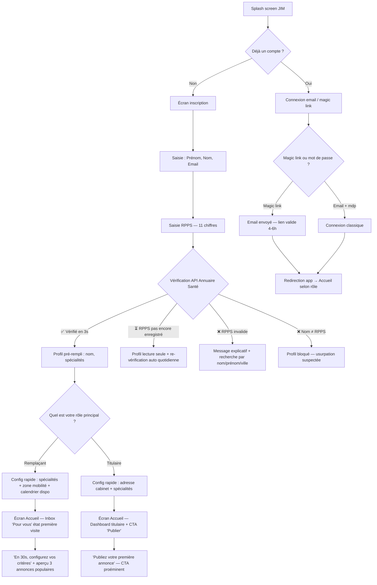
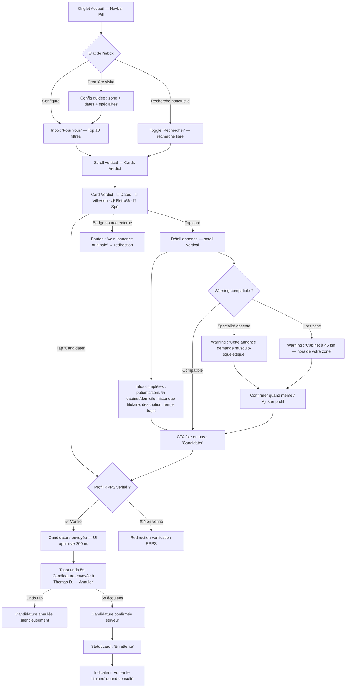
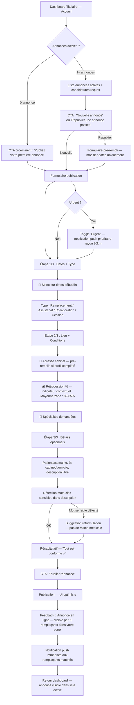
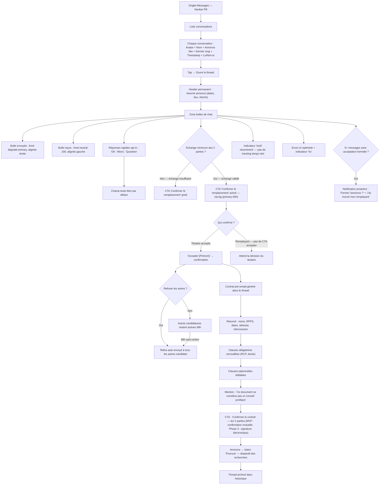
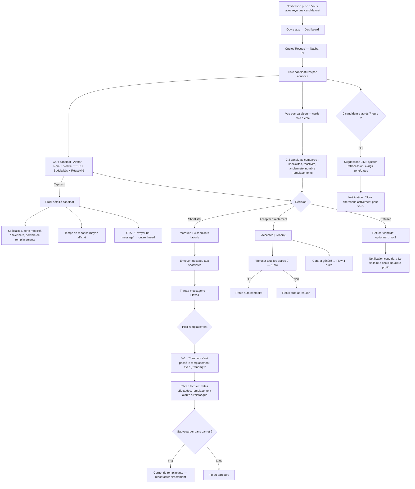

# UX Design Specification JIM (Job In Med)

**Author:** NathanBlottiaux
**Date:** 2026-02-28

---

## Executive Summary

### Project Vision

JIM (Job In Med) est une marketplace mobile-first pour les kinésithérapeutes libéraux en France, conçue pour couvrir l'intégralité du parcours de remplacement : recherche → candidature → messagerie → contrat → paiement. L'app mobile React Native/Expo est le produit principal pour tous les utilisateurs. La confiance est une propriété émergente du workflow complet — chaque étape intégrée renforce la suivante (vérification RPPS → candidature 1 clic → contrat IA → paiement sécurisé → fermeture automatique).

Le positionnement UX repose sur 3 piliers : fraîcheur temps réel des annonces (zéro annonce morte), vérification RPPS comme signal de confiance universel, et parcours complet sans fuite vers des outils externes (Facebook, WhatsApp, Word pour les contrats).

### Target Users

**Léa (24 ans) — Jeune remplaçante, segment d'acquisition prioritaire**
Digital native, smartphone exclusif, sans réseau professionnel. Cherche des remplacements géolocalisés, a besoin d'être guidée sur les aspects contractuels et administratifs. Pense en termes de DATES (quand suis-je dispo ?) avant de penser en termes de LIEU. Veut être rassurée, pas responsabilisée — le contrat doit dire "tout est conforme", pas "vérifiez les clauses". Son "aha moment" MVP : recevoir une notification push ciblée, candidater en 1 tap, être acceptée et échanger directement avec le titulaire. Phase 3 : contrat généré automatiquement + paiement à J+7.

**Thomas (30-42 ans) — Titulaire/assistant, segment de rétention**
Usage mobile + desktop au cabinet. Publie des remplacements courts et fréquents. Veut zéro effort : publier en < 2 minutes avec 3 champs max (dates, lieu, rétrocession), le reste en complétion progressive. A besoin de visibilité sur ses annonces (vues, candidatures) pour ne pas checker 3 plateformes en parallèle. Choisit ses remplaçants sur la base des spécialités, de l'expérience et de l'historique vérifié — le badge RPPS seul ne suffit pas. Son "aha moment" : 3 candidatures vérifiées RPPS le lendemain matin sans avoir rien fait de plus que poster une annonce.

**Michel (52+ ans) — Titulaire installé, segment d'accessibilité**
Zone semi-rurale, compétences numériques moyennes. Ne veut pas apprendre une nouvelle app. Besoin de magic link longue durée (4-6h, pas 15 min — il le voit entre deux patients), recherche RPPS par nom/ville (pas par numéro), et interface sans surcharge cognitive. Son parcours réel : il a ses remplaçants habituels dans un carnet, et ne vient sur JIM que quand aucun n'est disponible. L'empty state (carte vide en zone rurale) doit donner de l'espoir, pas confirmer l'isolement. Son "aha moment" : publier comme d'habitude et recevoir une candidature qu'il n'aurait jamais trouvée sur Facebook.

### Key Design Challenges

1. **Onboarding bi-profil sans friction** — Un seul flux d'inscription pour remplaçants et titulaires, avec vérification RPPS automatique en < 90 secondes. Magic link longue durée (4-6h) et recherche par nom pour tous (pas de mode séparé). Pont d'accessibilité entre Léa (24 ans) et Michel (52 ans).

2. **Coexistence annonces natives et agrégées** — Badge source discret (icône, pas couleur de fond). CTA différencié : native = "Candidater" (primaire), agrégée = "Voir l'originale" (secondaire) + "Alertes similaires" (primaire) + feedback "On invite ce titulaire sur JIM". Transition progressive : l'agrégation est un échafaudage qui se retire naturellement.

3. **Recherche : liste par dates ET carte** — L'écran d'accueil remplaçant propose une vue liste triée par dates/disponibilités comme vue principale, avec la carte en vue alternative (toggle). Les remplaçants pensent d'abord "quand suis-je dispo ?" avant "où ?". Chargement < 1s avec 200+ marqueurs, filtrage en temps réel (distance, dates, rétrocession).

4. **Messagerie intégrée anti-fuite** — Expérience de chat suffisamment fluide pour éviter la bascule vers WhatsApp. Coordonnées masquées avant acceptation de candidature = le chat JIM est le canal unique. Texte uniquement au MVP — risque identifié : demande de photos du cabinet pousse vers WhatsApp. Anticiper les pièces jointes en Phase 2.

5. **Paiement avec calcul automatique de rétrocession (Phase 3)** — Le titulaire paye le remplaçant via Stripe Connect. JIM calcule automatiquement le montant basé sur le taux de rétrocession convenu. Le défi UX : rendre le calcul transparent pour les deux parties (le titulaire voit ce qu'il paye, le remplaçant voit ce qu'il reçoit net).

6. **Empty states et zones à faible densité** — En zone rurale (Michel en Dordogne), la carte peut être vide. L'empty state doit donner de l'espoir ("Pas encore d'annonces ici — on vous prévient dès qu'il y en a" + CTA créer une alerte) au lieu de confirmer l'isolement. Premier écran = première impression.

### Design Opportunities

1. **Fraîcheur temps réel comme différenciateur visuel** — Badges de statut en temps réel (Active/En cours/Pourvue/Expirée) créent une confiance immédiate que Facebook, Rempleo et Physiorama ne peuvent pas offrir. "Vérifiée active aujourd'hui" = premier signal perçu.

2. **Pipeline de remplacement transparent** — Visualisation de bout en bout du parcours (candidature → discussion → accepté → contrat → paiement). Avantage structurel sur l'opacité du message privé Facebook. Chaque transition est visible et actionnable.

3. **Valeur immédiate dès l'inscription** — Agrégation pré-remplie + outils gratuits (contrat IA, calculateur rétrocession) offrent de la valeur sans masse critique. Le "moment zéro" n'est jamais une page vide.

4. **RPPS badge comme standard de confiance** — Badge visible sur chaque profil et candidature. Signal de confiance instantané, non reproductible par les concurrents informels (Facebook). Fondation visuelle de toute la chaîne de confiance.

5. **Contrat comme rassurance, pas responsabilité** — Le flow contrat affiche un résumé simple ("Tout est conforme — dates, RPPS, rétrocession vérifiés") au lieu de demander à l'utilisateur de vérifier les clauses. Réduit l'anxiété des jeunes remplaçants qui ne connaissent pas le cadre juridique.

6. **Indicateur rétrocession moyenne visible pour tous** — Déjà prévu pour les titulaires à la publication (FR12), l'étendre aux remplaçants lors de la consultation d'annonce. "Dans cette zone, la moyenne est 83%" aide les débutants à évaluer une offre.

### Focus Group Insights (Léa × Thomas × Michel)

| Insight | Impact UX | Priorité |
|---|---|---|
| Liste par dates > Carte comme écran principal (Léa) | Vue liste filtrée par dates comme défaut, carte en alternatif | Haute |
| Contrat = rassurance, pas vérification (Léa) | Flow contrat avec résumé "Tout est conforme" | Haute |
| Indicateur rétrocession pour les remplaçants aussi (Léa) | Étendre FR12 côté consultation | Moyenne |
| Notifications ciblées, pas massives (Léa) | 1 notif pertinente > 10 génériques | Haute |
| Formulaire publication 3 champs max (Thomas) | Dates, lieu, rétrocession obligatoires — reste en progressif | Haute |
| Stats annonce en temps réel (Thomas) | Compteur vues/candidatures sur dashboard titulaire | Moyenne |
| Risque fuite WhatsApp pour photos (Thomas) | Anticiper pièces jointes Phase 2 | Basse (MVP) |
| Magic link durée 4-6h (Michel) | Adapter la validité pour usage entre patients | Moyenne |
| Empty state = espoir, pas carte vide (Michel) | Message + CTA alerte au lieu de carte déserte | Haute |
| Carnet remplaçants comme point d'entrée (Michel) | FR58 central dans dashboard titulaire | Moyenne |
| Taille police système + zones tap 44×44 (Michel) | NFR43/NFR45 non négociables | Haute |

### Pre-mortem Analysis — Scénarios d'échec UX

| # | Scénario | Probabilité | Impact | Prévention |
|---|---|---|---|---|
| 1 | **Plateforme fantôme inversée** — 95% d'annonces agrégées avec badges bleus = "JIM est vide" | Haute | Critique | Badge discret, tri pondéré natif en premier, CTA "Alertes similaires" au lieu de redirect brutal |
| 2 | **Onboarding qui filtre** — Jeunes diplômés sans RPPS tombent sur "lecture seule" et ne reviennent pas | Haute | Élevé | Message engageant "Activation en cours", complétion profil pendant l'attente, notification push quand RPPS activé |
| 3 | **Titulaire dans le vide** — 0 candidature, 0 feedback, désinstallation silencieuse | Très haute | Critique | Feedback immédiat post-publication ("visible par X remplaçants"), compteur vues, suggestions proactives à J+3 |
| 4 | **Notification qui tue** — Trop de push → désactivation iOS → canal mort | Moyenne | Élevé | Max 3 push/jour, 3 toggles (Annonces/Candidatures/Messages), email digest fallback |
| 5 | **Mur de texte contractuel** — PDF juridique de 3 pages → panique chez les jeunes → abandon du contrat IA | Moyenne | Élevé | Résumé visuel in-app (5 points + ✅) avant le PDF, badge "Conforme Ordre MK" |
| 6 | **Michel n'ouvre jamais l'app 2x** — Carte vide, bouton publier invisible, magic link expiré | Haute | Élevé | Écran d'accueil par rôle, CTA publier proéminent, magic link 4-6h |

### War Room Decisions (PM × UX × Dev)

| # | Sujet | Décision | Trade-off accepté |
|---|---|---|---|
| 1 | **Écran d'accueil** | Par rôle (titulaire = dashboard, remplaçant = recherche). Toggle Liste (défaut) / Carte. Filtre dates manuel au MVP, matching calendrier Phase 3 | Deux parcours à maintenir, mais UX adaptée à chaque profil |
| 2 | **Annonces agrégées** | Badge discret (icône). CTA natif = "Candidater". CTA agrégé = "Voir l'originale" (secondaire) + "Alertes similaires" (primaire) + "On invite ce titulaire". **Fraîcheur :** re-crawl quotidien, badge "Vérifié il y a Xh", suppression automatique si source introuvable depuis 48h | Moins transparent visuellement, mais meilleure perception produit |
| 3 | **Formulaire publication** | 3 champs obligatoires (dates + ville autocomplete + rétrocession). Infos cabinet héritées du profil. Optionnels via complétion progressive post-publication | Annonces moins complètes au départ, mais taux de publication maximisé |
| 4 | **Contrat IA** | Résumé visuel in-app (5 points + ✅) → confirmation double (titulaire + remplaçant) → PDF à la demande. JSON unique en DB, deux rendus. Signature électronique Phase 3 | Pas de signature légale au MVP, confirmation mutuelle suffisante |
| 5 | **Notifications** | 3 toggles simples (Annonces/Candidatures/Messages), tout ON par défaut. Max 3 push/jour, résumé groupé si dépassement. Email digest hebdo si push désactivé | Pas de personnalisation fine, mais simple et maintenable |

## Core User Experience

### Defining Experience

**Action core : Chercher et candidater.**

Tout le design UX de JIM gravite autour de cette boucle fondamentale du remplaçant : ouvrir l'app → trouver une annonce pertinente → candidater en 1 tap. Si cette boucle est fluide, tout le reste suit — les titulaires reçoivent des candidatures, les contrats se génèrent, les paiements s'effectuent. Si cette boucle échoue, rien d'autre ne fonctionne.

Le titulaire a une boucle secondaire tout aussi critique : publier une annonce en < 2 min → recevoir des candidatures vérifiées → choisir et accepter. Mais c'est la boucle remplaçant qui alimente la marketplace. Sans candidatures, pas de titulaires satisfaits. L'acquisition commence par le remplaçant.

**Le "moment Uber" de JIM :**
Notification push géolocalisée → ouvrir l'app → l'annonce est là, pertinente, vérifiée active → candidater en 1 tap → confirmation instantanée. Temps total cible : < 30 secondes entre la notification et la candidature envoyée. C'est ce moment qui transforme un utilisateur curieux en utilisateur converti.

### Platform Strategy

**Mobile-first, mobile-primary :**
- App React Native/Expo = produit principal pour TOUS les utilisateurs (remplaçants + titulaires)
- Interaction tactile, optimisée pour une utilisation entre deux patients ou en déplacement
- Offline partiel : cache local des annonces consultées, file d'attente pour candidatures et messages
- Permissions demandées au bon moment : localisation (première carte), push (post-inscription), caméra (ajout photo)

**Web minimal au MVP :**
- Landing page Next.js : SEO, deep links, téléchargement app
- Pages publiques SSR (annonces, formations) pour l'indexation Google
- Pas de dashboard web avant Phase 3

**Contraintes device :**
- Support des tailles de police système (accessibilité Michel)
- Zones de tap minimum 44×44 points
- Performance sur devices variés (iPhone 7+ level) et connexions dégradées (3G rural)
- Taille app store < 50 MB

### Effortless Interactions

**Ce qui doit être invisible (zéro effort utilisateur) :**

| Interaction | Comment c'est effortless | Équivalent concurrent |
|---|---|---|
| Vérification RPPS | Automatique à l'inscription — l'utilisateur tape son numéro ou cherche par nom, la vérification se fait en < 3s | Rempleo : pas de vérification. Facebook : aucune |
| Fermeture d'annonce | Automatique quand le remplacement est pourvu (candidature acceptée → contrat confirmé → annonce fermée) | Facebook : l'annonce reste visible indéfiniment |
| Pré-remplissage contrat | Toutes les infos tirées du profil + de l'annonce. L'utilisateur n'a rien à saisir | Pas d'équivalent — contrats faits à la main |
| Relances candidatures | Automatiques : J+2 titulaire, J+5 remplaçant, J+7 expiration | Facebook : relances manuelles par commentaire |
| Publication annonce récurrente | "Republier" → tout est pré-rempli, seules les dates changent | Tout ressaisir sur chaque plateforme |
| Feedback post-publication | "Visible par X remplaçants dans votre zone" affiché immédiatement | Aucun feedback nulle part |
| Infos cabinet héritées | Profil titulaire → chaque annonce hérite type de cabinet, adresse, logement | Ressaisir à chaque annonce |

**Ce qui doit être rapide (< 2 taps) :**

- Candidater à une annonce : 1 tap + confirmation
- Accepter/refuser une candidature : 1 tap
- Refuser tous les autres après acceptation : 1 tap
- Ouvrir une conversation après acceptation : automatique
- Republier une annonce passée : 1 tap + modifier dates

**Ce qui doit être guidé (l'utilisateur ne sait pas quoi faire) :**

- Premier contrat de Léa : résumé visuel "Tout est conforme" + ✅ sur chaque clause
- Première publication de Thomas : indicateur rétrocession moyenne + formulaire 3 champs
- Empty state de Michel : message d'espoir + CTA "Créer une alerte"
- RPPS non encore enregistré : "Activation en cours — on vérifie chaque jour pour vous"

### Critical Success Moments

| Moment | Succès = | Échec = | Prévention |
|---|---|---|---|
| **Premier écran après inscription** | L'utilisateur voit des annonces pertinentes dans sa zone (grâce à l'agrégation) | Carte vide → "plateforme fantôme" → désinstallation | Agrégation pré-remplie + empty state engageant |
| **Première candidature** | 1 tap, confirmation instantanée, statut "En attente" visible | Flow complexe, page de chargement, erreur → "c'est pas fiable" | Candidature optimiste (UI confirme avant le serveur), file d'attente offline |
| **Première réponse titulaire** | Candidature(s) en < 48h, profils vérifiés RPPS | 0 candidature, 0 feedback, silence → "encore un site inutile" | Feedback immédiat post-publication, suggestions J+3, relance J+7 |
| **Premier contrat** | Résumé clair, 5 points + ✅, confirmation en 2 taps | PDF juridique incompréhensible → panique → abandon | Résumé in-app avant PDF, badge "Conforme Ordre MK" |
| **Première notification pertinente** | Annonce à 15km, dates dispo, rétro 85% → candidature en 30s | Notification spam sans pertinence → mute → canal mort | Max 3/jour, matching zone + dates, résumé groupé |
| **Retour après 1 semaine** | "3 nouvelles annonces dans votre zone" → l'app a de la valeur même passif | Rien de neuf, pas de raison de revenir | Notifications de réengagement ciblées, compteur "profil vu X fois" |
| **Transition de rôle** | Switch en 1 tap, profil conservé, historique factuel transféré, nouvel écran d'accueil immédiat | Devoir créer un nouveau compte ou perdre son historique | Switch dans les paramètres, données partagées |

### Experience Principles

**5 principes directeurs pour toutes les décisions UX de JIM :**

**1. Candidater < 30 secondes**
Du moment où le remplaçant voit une annonce pertinente au moment où sa candidature est envoyée : < 30 secondes, < 2 taps. C'est le North Star UX. Toute friction dans ce flow est un bug à corriger.

**2. Zéro silence, zéro vide**
Jamais de page vide (agrégation). Jamais de publication sans feedback (compteur vues). Jamais de candidature sans réponse (relances auto). Jamais de notification sans action possible. Le silence tue les marketplaces.

**3. Rassurer, pas responsabiliser**
L'utilisateur ne devrait jamais avoir à "vérifier" quoi que ce soit. Le contrat est conforme — on le dit. Le profil est vérifié RPPS — on le montre. La rétrocession est dans la moyenne — on l'affiche. JIM porte la charge cognitive, pas l'utilisateur.

**4. Même app, rôle fluide**
Remplaçant et titulaire ne sont pas deux catégories figées — c'est un continuum. Le remplaçant d'aujourd'hui est le titulaire de demain, et inversement. Le changement de rôle doit être un switch simple dans les paramètres (pas une réinscription). L'écran d'accueil s'adapte au rôle actif, les features d'accessibilité (magic link, recherche par nom, tailles de police) sont universelles. L'historique factuel (nombre de remplacements, ancienneté, spécialités) suit l'utilisateur quel que soit son rôle — un bon remplaçant devenu titulaire inspire confiance immédiatement.

**5. Chaque écran a une seule action principale**
Pas de surcharge. L'écran recherche = chercher. L'écran candidature = candidater. L'écran contrat = confirmer. Un CTA primaire par écran, le reste en secondaire. La clarté bat la richesse fonctionnelle.

### Customer Support Insights

| # | Pain point | Persona | Sévérité | Fix |
|---|---|---|---|---|
| 1 | Candidature sans réponse — titulaire a trouvé hors JIM sans prévenir | Léa | Critique | Bouton "Trouvé hors JIM" + expiration J+7 + annonces alternatives auto |
| 2 | Profil remplaçant vide = fantôme vérifié, titulaire ne peut pas choisir | Thomas | Élevé | Gate douce avant 1ère candidature + nudge spécialités + badge complétude |
| 3 | Taux de réactivité titulaire invisible → pas de conséquence au silence | Léa | Élevé | Afficher le taux de réponse sur le profil titulaire |
| 4 | Carte vide après refus localisation → aucun repère géographique | Michel | Élevé | Fallback "ville du cabinet" + autocomplete |
| 5 | Magic link trop court pour usage intermittent (entre patients) | Michel | Élevé | Durée 4-6h + "Recevoir un nouveau lien" en 1 tap |
| 6 | Écran titulaire = écran remplaçant → bouton publier invisible | Michel | Critique | Écran d'accueil par rôle dès le jour 1 |
| 7 | Complétion progressive du profil = profils incomplets en masse | Thomas | Élevé | Incentive "3x plus de réponses avec profil complet" |

### Reverse Engineering — Le "moment Uber" du remplaçant

**Flux parfait :** Notification → ouvrir l'app (5s) → lire le résumé (10s) → candidater (1s) → confirmation (< 1s) = 26 secondes.

**12 pré-requis amont identifiés :**

| Étape | Pré-requis critiques | Point de rupture principal | Fix |
|---|---|---|---|
| **Notification arrive** | Push activé + calendrier à jour + spécialités renseignées + annonce géocodée | Push désactivé iOS (40-60%) | Écran explicatif AVANT demande système, fallback email digest |
| **App s'ouvre sur l'annonce** | Session active + deep link configuré + annonce en cache | Session expirée → écran connexion | Refresh token silencieux, deep link Expo Router direct |
| **Lecture résumé (10s)** | Infos critiques au-dessus du fold + badge correspondance + rétro contextualisée | Infos sous le fold → scroll | Layout grille : 📅 Dates / 📍 Distance / 💰 Rétro + moy. / 🏥 Spécialité |
| **Candidater (1 tap)** | Bouton zone pouce + pas de modale "êtes-vous sûr" + candidature optimiste | Modale de confirmation = friction | Pas de modale (candidature rétractable FR64), UI optimiste + file offline |

**Annonce pourvue entre notif et ouverture :** jamais de cul-de-sac → "Pourvue. Voici 3 annonces similaires."

**Insight :** Le moment de 26 secondes repose sur 12 pré-requis construits sur des jours/semaines. L'expérience core n'est pas le bouton "Candidater" — c'est l'ensemble des micro-décisions en amont qui rendent ce bouton possible.

### Reverse Engineering — Le flux "zéro effort" du titulaire

**Flux parfait :** Publication (2 min) → feedback immédiat → 3 candidatures overnight → évaluation + choix (1h) → contrat (< 1 min) = 13 heures.

**8 pré-requis amont identifiés :**

| Étape | Pré-requis critiques | Point de rupture principal | Fix |
|---|---|---|---|
| **Publication (2 min)** | Profil cabinet pré-rempli + 3 champs obligatoires + rétro moyenne pré-positionnée | Profil cabinet vide → formulaire trop long | Onboarding cabinet post-inscription (30s, une seule fois) |
| **Feedback immédiat** | Calcul nombre remplaçants dans la zone | "Visible par 0 remplaçant" en zone rurale | Reformuler : "Annonce en ligne, recherche élargie" (jamais de chiffre déprimant) |
| **Candidatures overnight** | Push remplaçants activé + profils remplaçants complets | 0 candidature + silence | Notification J+1 "Votre annonce a été vue X fois", suggestions J+3 |
| **Évaluation candidats** | Fiche enrichie (spécialités, ancienneté, complétude, réactivité) | Profils fantômes vérifiés | Badge complétude + swipe horizontal pour comparer |
| **Messagerie** | Chat inline dans la fiche candidature | Bascule WhatsApp → perte tracking | Chat intégré sans quitter le contexte candidature |
| **Acceptation** | 1 tap + refus auto des autres (48h) | Oubli de refuser → candidats en attente | Post-acceptation : "Refuser tous ?" pré-sélectionné + refus auto 48h |
| **Contrat** | Données complètes + template pré-rempli | Données manquantes → contrat incomplet | Pré-validation silencieuse, demande inline si manque |
| **Confirmation double** | Notification immédiate au remplaçant + relance +2h | Remplaçant ne confirme pas | Relance auto, Thomas voit "En attente de confirmation" |

**Insight :** La qualité de l'expérience titulaire dépend directement de la complétude des profils remplaçants. Les deux boucles sont interdépendantes. Investir dans la complétion profil remplaçant améliore AUSSI l'expérience titulaire.

## Desired Emotional Response

### Primary Emotional Goals

**Modèle émotionnel bicouche :**

JIM opère sur deux couches émotionnelles distinctes qui se renforcent mutuellement :

| Couche | Émotion | Temporalité | Expression | Cible |
|---|---|---|---|---|
| **Surface** | Surprise de la vitesse | Premier contact, acquisition, bouche-à-oreille | "Trouvé en 30 secondes" — partageable, viral | Léa, nouveaux utilisateurs |
| **Profondeur** | Soulagement d'accompagnement | Usage répété, fidélisation, moments de stress | "JIM gère pour moi" — fidélisant, irremplaçable | Thomas, Michel, tous les récurrents |

**Pourquoi deux couches :** La surprise s'use — on ne peut être surpris qu'une fois par la vitesse. L'accompagnement se renforce — chaque usage confirme "je ne suis pas seul". La surprise est le marketing émotionnel (elle fait télécharger, elle fait parler). L'accompagnement est l'expérience émotionnelle (il fait rester, il fait revenir).

**Formule émotionnelle :**

```
Émotion JIM = Surprise (vitesse) × Confiance (vérification) × Soulagement (accompagnement)
         ↓               ↓                    ↓
    "C'est déjà fait?"  "C'est vérifié"    "JIM gère pour moi"
         ↓               ↓                    ↓
      SIGNAL            PREUVE              RACINE PROFONDE
```

**Racine émotionnelle (5 Whys) :** Les kinés libéraux portent tout seuls — soignant, chef d'entreprise, RH, juriste, commercial. Personne ne les aide. Quand JIM dit "c'est fait, c'est conforme, on gère" — c'est la première fois que quelque chose porte une partie de cette charge. L'émotion fondamentale n'est pas la surprise de la vitesse. C'est le soulagement d'être enfin accompagné. La vitesse n'est que le signal visible de cet accompagnement.

**Principe directeur : Promets la vitesse, délivre l'accompagnement.**

### Emotional Journey Mapping

| Phase | Moment | Émotion surface | Émotion profonde | Design cible |
|---|---|---|---|---|
| 1. Découverte | Entend parler de JIM par un collègue | Curiosité + scepticisme ("encore un truc?") | — | Le bouche-à-oreille porte la surprise : "30 secondes" |
| 2. Téléchargement | Ouvre l'app pour la première fois | Espoir prudent | — | Des annonces visibles immédiatement (agrégation) |
| 3. Inscription | RPPS vérifié en < 3 secondes | **Surprise** ("c'est déjà fait?") | Premier signal d'accompagnement | Feedback instantané : "Vérifié ✓" sans attente |
| 4. Première recherche | Annonces dans sa zone, filtrées par dates | Soulagement ("il y a du contenu") | Confiance naissante | Jamais de page vide — agrégation + empty state engageant |
| 5. Première candidature | 1 tap → confirmation instantanée | **Surprise maximale** ("c'est tout?") | "Quelqu'un s'occupe de moi" | Candidature optimiste + statut temps réel |
| 6. Attente réponse | Statut "Vu" → "En discussion" → "Accepté" | Patience confiante (pas anxiété) | Contrôle dans l'incertitude | Feedback progression temps réel (pattern Uber) |
| 7. Premier contrat | Résumé 5 points + ✅ | Soulagement ("tout est conforme") | **Accompagnement fort** ("JIM a géré le juridique") | Résumé visuel avant PDF, badge conformité |
| 8. Problème survient | Annulation, conflit, erreur | Inquiétude brève | **"JIM gère la situation"** — prise en charge, pas rassurance | Proactivité : JIM propose la solution, pas l'utilisateur |
| 9. Usage régulier | 5e, 10e remplacement | Surprise atténuée (normale) | **Soulagement permanent** ("je ne suis plus seul") | L'accompagnement se renforce à chaque usage |
| 10. Recommandation | Parle de JIM à un collègue | Fierté de la découverte | Générosité (partager ce qui m'aide) | La surprise se transmet : "30 secondes, je te jure" |

### Micro-Emotions

**4 axes émotionnels critiques pour JIM :**

| Axe | Émotion visée (+) | Émotion à éviter (−) | Levier design |
|---|---|---|---|
| **Confiance ↔ Méfiance** | "C'est vérifié, je peux y aller" | "C'est trop rapide, il y a un piège" | Accumulation de signaux (RPPS + badge comportement + micro-témoignage + politique annulation). La vitesse sans confiance = méfiance |
| **Contrôle ↔ Impuissance** | "Je sais où en est ma candidature" | "J'ai candidaté dans le vide" | Feedback progression temps réel : "Vu" → "En discussion" → "Accepté". Attente prévisible : "Réponse moyenne : 4h" |
| **Accompagnement ↔ Solitude** | "JIM gère pour moi" | "Je dois encore tout faire moi-même" | Proactivité de la plateforme : suggestions, relances auto, contrat pré-rempli, gestion d'erreur par JIM |
| **Attachement ↔ Indifférence** | "JIM se souvient de moi" | "C'est un outil froid et transactionnel" | Réengagement affectueux : "2 nouvelles annonces depuis mardi — on les garde au chaud". Ton chaleureux, pas corporate |

### Design Implications

**5 connexions émotion → design :**

| # | Émotion | Implication design | Exemple concret |
|---|---|---|---|
| 1 | **Surprise → Vitesse perçue** | Chaque interaction doit PARAÎTRE instantanée (UI optimiste, transitions fluides, pré-chargement). La vitesse réelle compte moins que la vitesse perçue | Candidature : bouton → animation "Envoyé ✓" en 200ms (avant la réponse serveur) |
| 2 | **Confiance → Accumulation de signaux** | Un seul signal (RPPS) ne suffit pas. La confiance se construit par couches successives visibles simultanément | Fiche candidat : badge RPPS + spécialité + ancienneté + taux réactivité + micro-témoignage = confiance complète |
| 3 | **Accompagnement → Proactivité plateforme** | JIM ne doit JAMAIS attendre que l'utilisateur agisse face à un problème. La plateforme propose, l'utilisateur confirme | Annonce sans candidature J+3 : JIM suggère "Élargir la zone de 10km ?" ou "Ajuster la rétrocession à 85% ?" |
| 4 | **Contrôle → Transparence du statut** | Chaque action a un retour visible, chaque attente a une estimation, chaque étape a un statut | Pipeline visuel : Candidature → Vu → En discussion → Accepté → Contrat → Confirmé |
| 5 | **Attachement → Ton chaleureux** | Le copywriting de JIM est celui d'un collègue bienveillant, pas d'une plateforme. Rareté encourageante ("Votre profil correspond bien"), pas urgence stressante ("Dépêchez-vous") | Push : "2 nouvelles annonces près de chez vous — on les garde au chaud" au lieu de "Nouvelles annonces disponibles" |

**Patterns émotionnels empruntés (Genre Mashup) :**

| Pattern | Source | Application JIM |
|---|---|---|
| Feedback de progression temps réel | Uber | Statut candidature "Vu → En discussion → Accepté" |
| Attente prévisible | Uber | "Temps de réponse moyen dans cette zone : 4h" |
| Confiance par accumulation de signaux | Airbnb | RPPS + badge comportement + micro-témoignage + politique = confiance complète |
| Rareté encourageante | Airbnb | "4 candidatures — votre profil correspond bien" (pas "Dépêchez-vous") |
| Réengagement affectueux | Duolingo | "2 nouvelles annonces depuis mardi — on les garde au chaud" |

### Emotional Design Principles

**5 principes pour toutes les décisions émotionnelles de JIM :**

**1. Promets la vitesse, délivre l'accompagnement**
L'acquisition se fait sur la surprise ("30 secondes"). La rétention se fait sur le soulagement ("JIM gère"). Ne jamais sacrifier l'un pour l'autre — les deux opèrent à des temporalités différentes et se renforcent.

**2. La vitesse sans confiance = méfiance**
Chaque accélération du parcours doit s'accompagner d'un signal de confiance visible. Candidature en 1 tap ? Oui, mais le profil candidat affiche RPPS + spécialité + ancienneté + nombre de remplacements. Contrat en 2 taps ? Oui, mais le résumé affiche "Tout est conforme ✅".

**3. JIM porte, l'utilisateur confirme**
Face à un problème (annulation, 0 candidature, conflit), JIM ne dit pas "voici vos options". JIM dit "voici ce qu'on propose — ça vous va ?". La charge cognitive reste sur la plateforme. L'utilisateur a le dernier mot sans avoir fait le travail.

**4. Chaque silence est un bug émotionnel**
Publication sans feedback = anxiété. Candidature sans statut = impuissance. Erreur sans prise en charge = abandon. Chaque moment sans signal est un moment où l'utilisateur doute. Le design émotionnel de JIM est un design ANTI-SILENCE.

**5. Ton de collègue, pas de plateforme**
JIM parle comme un confrère bienveillant qui aide, pas comme un SaaS qui notifie. "On les garde au chaud" au lieu de "Nouvelles annonces disponibles". "Votre profil correspond bien" au lieu de "Postulez maintenant". La chaleur du ton crée l'attachement que les features seules ne peuvent pas produire.

## UX Pattern Analysis & Inspiration

### Inspiring Products Analysis

#### 1. Doctolib — Le standard santé français

| Pattern UX | Application JIM | Mécanisme cognitif |
|---|---|---|
| Recherche unifiée (spécialité + lieu) → résultats instantanés | Type d'annonce + zone → résultats. Pas de formulaire complexe | Réduction du choix — moins de champs = décision plus rapide |
| Consultation libre, compte requis au moment de l'action | Navigation annonces libre, compte requis pour candidater | Gate au bon moment — valeur avant engagement |
| Fiche praticien : photo + spécialité + disponibilités en grille | Fiche annonce : 4 données critiques au-dessus du fold | Pattern recognition — toujours au même endroit |
| Confirmation en 1 écran résumé | Candidature en 1 tap + undo 5 secondes | Réduction friction — agir d'abord, corriger si besoin |
| Notifications ciblées (rappel RDV), pas de spam | Push ciblées (annonce match), max 3/jour | Signal/bruit — pertinence > volume |

#### 2. Instagram — Le scroll et le visuel

| Pattern UX | Application JIM | Mécanisme cognitif |
|---|---|---|
| Scroll vertical, contenu visuel prioritaire, like = 1 tap | Liste annonces scrollable, données visuelles, candidater = 1 tap | Coût d'interaction minimal — 1 action = 1 tap |
| 5 onglets bottom nav, chaque onglet = 1 fonction | Bottom nav 4 onglets adaptés au rôle | Navigation spatiale — position fixe = mémoire musculaire |
| Profil = grille + bio + stats | Profil kiné = spécialités + stats (remplacements, fiabilité) | Identité en un coup d'oeil |
| Transition fluide profil → DM | Transition fluide annonce → candidature → message | Flow continu — pas de rupture de contexte |

#### 3. Messenger — La messagerie de référence

| Pattern UX | Application JIM | Mécanisme cognitif |
|---|---|---|
| Avatar + nom + dernier message + timestamp + lu/non-lu | Liste conversations avec contexte annonce en header | Reconnaissance > rappel — aperçu sans ouvrir |
| Bulles colorées différenciées (envoyé vs reçu) + dégradés | Bulles avec dégradé pour messages envoyés, neutre pour reçus (contrainte : WCAG AA 4.5:1) | Encodage visuel — direction du message immédiate |
| Envoi instantané (UI optimiste) + indicateur "vu" | Candidature optimiste + statut "Vu par le titulaire" | Feedback loop — chaque action a une réponse |
| Point vert "en ligne" | Indicateur "Actif récemment" (pas de tracking temps réel d'un professionnel) | Présence sociale — sentiment de connexion |

### Inspiration visuelle

**Screenshot messagerie (référence chat JIM) :** Fond avec dégradés subtils, bulles distinctes envoyé/reçu, avatars ronds + indicateurs de présence, preview dernier message dans la liste conversations, espacement généreux.

**Screenshot listings (référence annonces JIM) :** Cards arrondies avec ombre douce sensation premium, hiérarchie typographique forte (titre bold, sous-infos légères), bottom nav minimaliste, palette chaude (beige/brun) accueillante.

### Reconstruction First Principles

**5 vérités fondamentales du contexte kiné :**

**1. Le contexte d'usage est ENTRE DEUX PATIENTS.**
15 secondes disponibles, une seule main libre, cerveau fatigué après 3h de soins. Chaque écran doit être SCANNABLE en 3 secondes, pas lisible en 30 secondes.

**2. Le remplaçant ne CHERCHE pas, il RÉAGIT.**
Le flux naturel = notification → ouvrir → pertinent ? → candidater. L'écran principal n'est pas un moteur de recherche mais un inbox d'opportunités filtrées baptisé "Pour vous".

**3. Le titulaire ne BROWSE pas, il PUBLIE puis ATTEND.**
Son écran principal = dashboard d'annonces actives avec candidatures reçues. CTA "Publier" proéminent si aucune annonce active.

**4. La décision se prend sur 4 données, pas 12.**
📅 Dates, 📍 Ville + distance, 💰 Rétrocession %, 🏥 Spécialité compatible. Le reste (patients/sem, % cabinet/domicile, historique titulaire, description) est accessible dans le détail.

**5. La conversation est TRANSACTIONNELLE, pas sociale.**
3 à 5 messages en moyenne. Thread de confirmation avec contexte annonce permanent en header et CTA "Confirmer le remplacement" fixe.

**3 états de l'écran Accueil remplaçant :**

| État | Contenu | Cas |
|---|---|---|
| **Première visite** | Configuration guidée ("En 30s, configurez vos critères") + aperçu 3 annonces populaires de la zone | Nouveau remplaçant |
| **Configuré** | Inbox "Pour vous" filtré, top 10 + "Voir plus" | Usage récurrent (Léa) |
| **Recherche ponctuelle** | Toggle "Rechercher" en haut de l'inbox pour recherche libre sans modifier les critères | Usage occasionnel (Thomas remplaçant) |

**Card verdict — 4 données strictes :**

```
┌─────────────────────────────┐
│ 📅 12-15 mars               │
│ 📍 Mérignac · 8 km          │
│ 💰 85%  🏥 Compatible ✓     │
│             [Candidater]     │
└─────────────────────────────┘
```

Card = verdict rapide (scan 3s). Détail au tap = patients/sem, % cabinet/domicile, historique titulaire, description, temps trajet.

**Flow titulaire séquencé :**

Candidatures reçues (comparaison cards) → Shortlister 1-3 candidats → Chat avec shortlistés (thread confirmation) → Accepter 1 candidat (1 tap) → Refus auto des autres (48h) → Contrat généré.

### Transferable UX Patterns

**Patterns de navigation :**

| Pattern | Source | Application JIM |
|---|---|---|
| Bottom tab bar 4 onglets | Instagram | Accueil (adapté au rôle), Candidatures (label dynamique par rôle), Messages, Profil |
| Labels dynamiques selon le rôle | First Principles | Remplaçant = "Mes candidatures", Titulaire = "Reçues" |
| Scroll vertical pour le détail | Screenshot listings | Fiche annonce scrollable avec CTA fixe en bas |
| Accès rapide disponibilités | Focus Group (Léa) | Shortcut en 1 tap depuis Accueil remplaçant |

**Patterns d'interaction :**

| Pattern | Source | Application JIM |
|---|---|---|
| Action principale = 1 tap | Instagram | Candidater = 1 tap, pas de modale de confirmation |
| Undo 5 secondes | Gmail | Toast "Candidature envoyée — Annuler" avec preview profil envoyé |
| UI optimiste | Messenger | Animation "Envoyé ✓" en 200ms avant confirmation serveur |
| Indicateur "vu" | Messenger | Statut "Vu par le titulaire" sur la candidature |
| Écran comparaison candidats | Focus Group (Thomas) | Cards comparatives côte à côte AVANT les chats individuels |
| Réponses rapides chat opt-in | Messenger adapté | Suggestions simples ("Ok", "Merci", "Question") — champ texte libre par défaut |
| CTA Confirmer activé après échange | Good Cop Bad Cop | Bouton grisé → activé après échange minimum des deux parties |

**Patterns visuels :**

| Pattern | Source | Application JIM |
|---|---|---|
| Cards arrondies + ombre douce | Screenshot listings | Cards annonces et candidatures, sensation premium |
| Palette chaude en surfaces et accents | Screenshot listings | Chaleur dans backgrounds/accents. Texte = noir/gris foncé, contraste WCAG AA (4.5:1) |
| Espacement généreux | Screenshots 1+2 | Whitespace = clarté = scannabilité 3 secondes |
| Hiérarchie typo forte | Screenshot listings | Titre bold, sous-infos légères, rétro mise en avant |
| Multi-annonces par écran | Anti-Rempleo | 3-4 cards visibles (2 sur iPhone SE), jamais 1 annonce = 1 écran |
| Avatars ronds + badges | Screenshot messagerie | Avatar + badge RPPS + indicateur "Actif récemment" |

**Patterns d'accessibilité :**

| Pattern | Spécification | Source |
|---|---|---|
| Taille police | Respect de la taille système (Dynamic Type iOS, Accessible Font Android) | NFR43 |
| Zones de tap | Minimum 44×44 points sur tous les boutons et liens | NFR45 |
| Contraste | WCAG AA minimum (4.5:1 texte, 3:1 éléments UI) | NFR43 |
| Lecteur d'écran | Labels accessibles sur tous les éléments interactifs | NFR43 |
| Réduction de mouvement | Respecter `prefers-reduced-motion` pour les animations | Standard |

**Patterns offline / réseau dégradé :**

| Pattern | Comportement | Feedback utilisateur |
|---|---|---|
| Cache annonces | Dernières annonces consultées disponibles hors ligne | Badge "Hors ligne" discret en haut |
| Candidature offline | Mise en file d'attente locale | "Candidature enregistrée — envoi dès reconnexion" |
| Messages offline | Messages en attente avec indicateur | Horloge à côté de la bulle, "Envoi en cours..." |
| Reprise réseau | Sync automatique silencieuse au retour connexion | Toast bref "Connecté — 2 actions synchronisées" |

### Anti-Patterns to Avoid

**Jamais (bloquant UX) :**

| Anti-pattern | Pourquoi | Alternative JIM |
|---|---|---|
| 1 annonce par écran (Rempleo) | Impossible de scanner et comparer | 3-4 cards verdict par écran, scannable en 3 secondes |
| Modale "Êtes-vous sûr ?" avant action | Friction, casse le momentum 30 secondes | Pas de modale — undo 5s post-action (Gmail pattern) |
| Tutoiement | Contexte professionnel français | Vouvoiement obligatoire partout |

**Éviter au MVP :**

| Anti-pattern | Pourquoi | Alternative JIM |
|---|---|---|
| Bleu médical froid | Clinique, institutionnel | Palette chaude + tons accueillants |
| Formulaire recherche multi-champs | Surcharge cognitive | 2 filtres visibles (zone + dates), avancés en "Plus" |
| Dark mode par défaut | Redesign palette complet nécessaire | Thème clair par défaut, dark mode repoussé post-MVP |
| Scroll infini sans limite | Perte de focus sur 40+ résultats | Top 10 pertinents + "Voir X autres" |
| Chat séparé du contexte | Perte du lien avec l'annonce | Chat inline avec header annonce permanent |

**Attention (risque modéré) :**

| Anti-pattern | Pourquoi | Alternative JIM |
|---|---|---|
| Emojis décoratifs en masse | Pas professionnel | Max 1-2 emojis fonctionnels par message |
| Ton infantilisant | "On vous a trouvé des pépites !" ≠ professionnel de santé | Ton pro-chaleureux sobre |
| Onboarding carousel | Personne ne lit | Valeur immédiate dès le premier écran |
| Hamburger menu | Cache la navigation | Bottom nav visible avec 4 onglets |

### Design Inspiration Strategy

**Ce qu'on adopte :**

| Pattern | Raison |
|---|---|
| Bottom nav 4 onglets avec labels dynamiques par rôle | Standard mobile, zéro apprentissage, adapté aux 2 profils |
| Cards arrondies + ombre, multi-annonces par écran | Sensation premium, scannabilité, anti-Rempleo |
| Bulles chat avec dégradé (accent uniquement, WCAG AA vérifié) | Distinction claire envoyé/reçu, esthétique moderne |
| UI optimiste + undo 5s | Vitesse perçue + gestion fat finger sans friction modale |
| Vouvoiement + ton pro-chaleureux | Contexte professionnel de santé français |

**Ce qu'on adapte :**

| Pattern | Adaptation |
|---|---|
| Feed Instagram → Inbox "Pour vous" | Opportunités filtrées par critères, top 10 + "Voir plus", 3 états (première visite / configuré / ponctuel) |
| Card listing → Card verdict 4 données | 📅 Dates · 📍 Ville + km · 💰 Rétro % · 🏥 Spé compatible. Détail au tap : patients/sem, % cabinet/domicile, historique |
| Chat Messenger → Thread de confirmation | Header contexte annonce permanent, réponses rapides opt-in, CTA "Confirmer" activé après échange minimum |
| Palette chaude → Chaleur + contraste | Surfaces et accents chaleureux, texte noir/gris foncé WCAG AA, pas de beige sur blanc |
| "En ligne" → "Actif récemment" | Pas de tracking temps réel d'un professionnel entre deux patients |

**Ce qu'on évite :**

| Anti-pattern | Raison |
|---|---|
| 1 annonce par écran (Rempleo) | Scannabilité 3s impossible |
| Dark mode au MVP | Redesign complet, repoussé post-MVP |
| Tutoiement et ton infantilisant | Contexte professionnel exige respect |
| Recherche comme écran principal | Le remplaçant réagit (inbox), il ne cherche pas |
| Modale de confirmation | Undo post-action suffit |

### Spectre ton pro-chaleureux

| Trop froid ❌ | Pro-chaleureux ✅ | Trop familier ❌ |
|---|---|---|
| "Nouvelles annonces disponibles" | "3 nouvelles annonces près de Mérignac" | "On vous a trouvé des pépites !" |
| "Candidature envoyée" | "Votre candidature a été envoyée à Thomas D." | "C'est parti, on croise les doigts !" |
| "Aucun résultat" | "Pas encore d'annonces ici — nous vous prévenons dès qu'il y en a" | "Oups, c'est vide par ici !" |
| "Erreur de connexion" | "La connexion a échoué — nous réessayons automatiquement" | "Aïe, ça bug ! Réessayez ?" |
| "Mise à jour profil" | "Votre profil a été mis à jour" | "Profil tout beau tout neuf !" |
| "Annonce sans candidature" | "Votre annonce est visible — nous cherchons des remplaçants" | "Patience, ça va venir !" |

**Règle :** Vouvoiement + personnalisation (nom, ville, données concrètes) + absence de jargon tech + absence d'exclamations excessives. Emojis comme icônes fonctionnelles dans l'app uniquement (📅📍💰🏥), pas dans les notifications push.

### Onboarding titulaire première visite

| Étape | Contenu | Durée |
|---|---|---|
| 1 | "Publiez votre première annonce" — CTA proéminent, pas de dashboard vide | 0s (immédiat) |
| 2 | Formulaire 3 champs (dates + ville + rétro) — profil cabinet pré-rempli si complété | < 2 min |
| 3 | Feedback : "Annonce en ligne — visible par X remplaçants dans votre zone" | Instantané |

### Transition de rôle

| Élément | Comportement |
|---|---|
| Switch | Dans Profil > "Changer de rôle" — toggle simple |
| Navigation | Labels bottom nav changent (Mes candidatures ↔ Reçues) |
| Écran d'accueil | Transition vers inbox remplaçant OU dashboard titulaire |
| Données | Historique factuel conservé. Profil unifié |
| Feedback | "Vous êtes maintenant en mode [remplaçant/titulaire]" |

## Design System Foundation

### Design System Choice

**Approche :** Système themeable custom — NativeWind v4 + composants custom `@jim/ui` + tokens partagés web/mobile.

**Starter kit JIM :** Expo SDK + Supabase + NativeWind v4 + Expo Router + pnpm workspace. Pas de template marketplace monolithique — un assemblage intentionnel de briques matures.

### Architecture Decision Records

**ADR-001 : NativeWind v4 comme styling foundation**
- **Décision :** Adopter NativeWind v4 (Tailwind CSS pour React Native) avec thème partagé web/mobile
- **Raison :** Syntaxe identique au Tailwind du Next.js web, utility-first pour prototypage rapide, design tokens partagés via `tailwind.config.js`, communauté massive
- **Alternatives rejetées :** Tamagui (syntaxe différente du web), Gluestack UI (composants avec opinions), StyleSheet natif (verbeux, pas de tokens partagés), React Native Paper (Material Design imposé)
- **Trade-offs :** Pas de composants pré-faits (investissement custom), NativeWind v4 récent (moins battle-tested), classes longues dans le JSX (encapsulées dans les primitives)
- **Mitigations :** Lock version, `eslint-plugin-tailwindcss` dès jour 1, fallback codemod vers StyleSheet si nécessaire
- **Condition de révision :** Si incompatibilité Expo SDK 52+ ou perfs insuffisantes sur Android bas de gamme

**ADR-002 : Composants custom `@jim/ui`**
- **Décision :** Construire une bibliothèque de composants custom sur NativeWind + React Native Reanimated + Gesture Handler
- **Raison :** Patterns UX JIM spécifiques au domaine (card verdict, inbox 3 états, thread confirmation), zéro dépendance UI tierce
- **Règle critique :** Features first, composants second. Jamais de composant créé à l'avance — chaque composant naît d'un écran réel. Migration dans `ui/` quand un 2e écran en a besoin
- **Documentation :** TypeScript strict dès jour 1, `COMPONENTS.md` dès mois 1 avec checklist accessibilité 8 points, Storybook React Native dès mois 2
- **Condition de révision :** Si équipe grandit à 3+ devs, évaluer extraction en package npm interne

**ADR-003 : Liquid glass = accent post-MVP**
- **Décision :** Liquid glass (glassmorphism) repoussé en Phase 2. MVP = ombres douces + coins arrondis. Pas de blur
- **Raison :** Solo dev, budget temps limité, perfs blur Android variables, maintenance régulière nécessaire
- **Implémentation Phase 2 :** `expo-blur` BlurView sur max 3 surfaces (header, bottom sheet, modale). Benchmark blur au premier lancement — si > 12ms, fallback opaque automatique
- **Règle sécurité :** Blur JAMAIS au-dessus de données sensibles (coordonnées, conversations). Overlay opaque obligatoire si contenu sensible en arrière-plan
- **Budget maintenance :** 2-3 jours par semestre pour ajustements
- **Condition de révision :** Si tendances design s'éloignent du glassmorphism ou si perfs Android insuffisantes

**ADR-004 : Tokens partagés — source unique**
- **Décision :** `tailwind.config.js` comme source unique des tokens, exports TypeScript via script build-time
- **Raison :** Un changement = cohérence immédiate web + mobile, zéro maintenance parallèle
- **Mécanisme :** Script `extract-tokens.js` génère `tokens/index.ts` statique au build. Pas de `resolveConfig` runtime (économie ~15-20kb bundle). Fichier généré versionné dans git
- **Tokens sémantiques :** Définis dès le départ dans le config (`cta-bg`, `card-bg`, `verification-badge`, `heading-color`) pour flexibilité future
- **Setup :** Workspace pnpm minimal (pas Turborepo/Nx au MVP)
- **Révision Step 8 :** Mécanisme changé de resolveConfig runtime → script build-time pour performance bundle mobile

### Design Tokens

**Palette (orientations) :**

| Token primitif | Orientation | Token sémantique |
|---|---|---|
| `primary` | Couleur chaude identitaire (terracotta / ambre / corail doux) | `cta-bg`, `nav-active`, `badge-accent` |
| `secondary` | Vert/bleu doux de confiance | `verification-badge`, `success-accent` |
| `surface` | Blanc cassé / crème très léger | `card-bg`, `screen-bg`, `input-bg` |
| `text-primary` | Noir / gris très foncé (#1A1A1A) — contraste 12:1+ | `heading-color`, `body-color` |
| `text-secondary` | `neutral-500` (#7A6E64) — contraste 5.4:1+ | Sous-infos, timestamps |
| `success` | Vert | Confirmations, "Vérifié ✓" |
| `warning` | Ambre | Alertes douces, "En attente" |
| `error` | Rouge doux (pas agressif) | Erreurs, annulations |
| `gradient-chat` | Dégradé primary → primary-dark | Bulles messages envoyés (WCAG AA vérifié au point le plus clair) |

**Typographie :**

| Token | Spécification | Usage |
|---|---|---|
| `heading-lg` | 24px bold | Titres d'écran |
| `heading-md` | 18px semibold | Titres de section |
| `body` | 16px regular (minimum lisibilité) | Texte principal |
| `body-sm` | 14px regular | Sous-infos, timestamps |
| `caption` | 12px regular | Badges, labels secondaires |
| `system` | Dynamic Type iOS / Accessible Font Android | Respecte les réglages utilisateur |

**Espacement :**

| Token | Valeur | Usage |
|---|---|---|
| `space-xs` | 4px | Espacement interne badges |
| `space-sm` | 8px | Espacement entre éléments proches |
| `space-md` | 16px | Padding standard cards et sections |
| `space-lg` | 24px | Espacement entre cards, sections |
| `space-xl` | 32px | Marges d'écran, séparations majeures |

**Rayons et ombres :**

| Token | Valeur | Usage |
|---|---|---|
| `radius-sm` | 8px | Boutons, badges, inputs |
| `radius-md` | 12px | Cards annonces, cards candidatures |
| `radius-lg` | 20px | Bottom sheets, modales |
| `radius-full` | 9999px | Avatars, pills |
| `shadow-card` | 0 2px 8px rgba(0,0,0,0.08) | Cards standard |
| `shadow-elevated` | 0 4px 16px rgba(0,0,0,0.12) | Bottom sheets, éléments flottants |

### Architecture composants

**3 couches par dépendance :**

| Couche | Dossier | Responsabilité | Connaît le métier ? | Connaît le routing ? |
|---|---|---|---|---|
| **UI** | `src/components/ui/` | Briques pures réutilisables | Non | Non |
| **Screens** | `src/components/screens/` | Assemblages métier JIM | Oui | Non |
| **Pages** | `src/app/(tabs)/` | Routes Expo Router | Oui | Oui |

**Structure complémentaire :**
- `src/components/layout/` — Composants liés au routing (BottomNav, Header, RoleSwitch, ScreenWrapper)
- `src/tokens/index.ts` — Généré par script build-time `extract-tokens.js` depuis `tailwind.config.js`

**Composants UI (`src/components/ui/`) :**

| Composant | Priorité MVP | `sharedTransitionTag` |
|---|---|---|
| Button | Critique | — |
| Text (Dynamic Type wrapper) | Critique | — |
| Input | Critique | — |
| Card | Critique | — |
| CardVerdict | Critique | `annonce-${id}` (prêt Phase 2 transitions) |
| Badge | Critique | — |
| Avatar | Critique | — |
| Toast | Critique | — |
| EmptyState | Haute | — |
| FilterBar | Haute | — |
| ProfileCard | Haute | — |
| CandidCompare | Haute | — |
| FormPublication | Haute | — |
| MessageBubble | Haute | — |

**Composants Screens (`src/components/screens/`) :**

| Composant | Description |
|---|---|
| `inbox/InboxConfigured` | État inbox filtré (usage récurrent) |
| `inbox/InboxFirstVisit` | Configuration guidée 30s + aperçu annonces |
| `inbox/InboxSearch` | Recherche ponctuelle sans modifier les critères |
| `dashboard/DashboardTitu` | Annonces actives + compteur candidatures + CTA Publier |
| `chat/ThreadChat` | Header contexte annonce + bulles dégradé + CTA Confirmer |

### Checklist accessibilité par composant

Chaque composant `@jim/ui` doit valider ces 8 points AVANT merge :

```
□ Zone tap minimum 44×44 points
□ Contraste texte WCAG AA (4.5:1) vérifié sur TOUS les états
□ Dynamic Type testé à 150% (maxFontSizeMultiplier)
□ VoiceOver : accessibilityLabel descriptif sur chaque élément interactif
□ VoiceOver : accessibilityRole correct (button, header, link, etc.)
□ Distinction possible SANS couleur (bordure, forme, texte)
□ États disabled expliqués en texte (pas juste grisé)
□ Focus order logique (tab order)
```

**Règles spécifiques :**
- BottomNav : icône + label texte toujours (jamais icône seule)
- Onglet actif : distinguable sans couleur (bold + trait ou fond)
- Badge notification : chiffre minimum 16px sur fond coloré
- Toast candidature : "Candidature envoyée — Annuler" sans nom du titulaire (confidentialité perçue)
- CTA Confirmer chat : texte explicatif quand grisé ("Échangez d'abord avec le titulaire")

### Implementation Timeline

| Semaine | Livrable utilisateur | Composants créés | Checkpoint |
|---|---|---|---|
| **0** | Setup : Expo + NativeWind v4 + Expo Router + workspace pnpm + tokens + linter + SETUP.md | Aucun | Setup reproductible < 1 jour |
| **1** | Inscription + RPPS + Profil | Button, Input, Text, Badge, Avatar, Toast | — |
| **2** | Inbox remplaçant (3 états) + données mockées | CardVerdict, FilterBar, EmptyState, BottomNav | — |
| **3** | Dashboard titulaire + publication annonce | DashboardTitu, FormPublication, RoleSwitch | **Test utilisateur : montrer à 3-5 kinés** |
| **4** | Candidatures reçues + comparaison | CandidCompare, ProfileCard | — |
| **5** | Chat basique + connexion Supabase Realtime | ThreadChat, MessageBubble | — |
| **6** | Connexion APIs réelles + fix bugs + test devices | Aucun nouveau — stabilisation | Premier utilisateur |
| **Post-MVP** | Liquid glass, shared transitions, Storybook, animations | BottomSheet (blur), Header (blur) | — |

### Documentation obligatoire

| Document | Contenu | Quand |
|---|---|---|
| `SETUP.md` | Setup reproductible Expo + NativeWind + Supabase + workspace | Semaine 0 |
| `COMPONENTS.md` | Liste composants + props + usage + checklist accessibilité | Après 5 premiers composants |
| Storybook React Native | Preview visuel isolé de chaque composant | Mois 2 (> 10 composants) |
| `tailwind.config.js` commenté | Tokens avec justification de chaque choix | Semaine 0 |

## Defining Core Experience (approfondissement)

> **Note :** Cette section approfondit et détaille la "Core User Experience" définie plus haut. En cas de divergence, cette section fait autorité car elle résulte d'une analyse itérative plus poussée (boucle en 6 phases, scroll d'opportunités, mécaniques détaillées).

### 2.1 Defining Experience

**La phrase que Léa dit à un collègue entre deux patients :**

> "Tu ouvres JIM, t'as plein d'annonces fraîches, tu scrolles, tu candidates — c'est fait."

**L'expérience qui définit JIM n'est pas un bouton. C'est une boucle.**

Le "moment Uber" de 26 secondes (notification → candidature) est le SIGNAL d'entrée. L'expérience complète qui fait dire "ça a marché" est un cycle en 6 phases, déployé progressivement :

| # | Phase | Horizon | Émotion dominante | Durée |
|---|---|---|---|---|
| 1 | **Scroll & Discover** — Ouvrir l'inbox, scroller des annonces pertinentes et fraîches | MVP | Gratification du scroll d'opportunités + surprise de la pertinence | 30s - 2min |
| 2 | **Candidater** — 1 tap sur l'annonce qui matche | MVP | Satisfaction de l'action rapide | < 5s |
| 3 | **Formaliser** — Acceptation + contrat confirmé | MVP | Soulagement ("tout est en règle") | 1h - 48h |
| 4 | **Transmettre** — Recevoir les transmissions du titulaire (planning patients, spécificités cabinet, accès) | Phase 2 | Sérénité ("je sais où je vais") | Avant le remplacement |
| 5 | **Exercer** — Effectuer le remplacement sereinement | N/A (hors app) | JIM en arrière-plan | Durée du remplacement |
| 6 | **Clôturer** — Voir le récap + recevoir le virement | Phase 3 | Accomplissement ("ça a marché") | Après le remplacement |

**"Ça a marché" — défini par horizon :**

| Horizon | Remplaçant | Titulaire |
|---|---|---|
| **MVP** | "Je suis pris et j'ai échangé avec le titulaire" | "J'ai trouvé quelqu'un de vérifié" |
| **Phase 2** | + "Je sais exactement ce qui m'attend" (transmissions) | + "Il est bien préparé" |
| **Phase 3** | + "J'ai été payé" (cycle complet) | + "C'est réglé financièrement" |

**Le scroll d'opportunités :**

JIM emprunte à Instagram le mécanisme de scroll vertical continu d'opportunités. La différence : chaque card scrollée a une valeur professionnelle réelle (dates, lieu, rétro, spé), pas du contenu consommable. Le scroll est engageant parce que chaque nouvelle card est une opportunité potentielle.

| Instagram | JIM |
|---|---|
| Scroll infini de contenu | Top 10 pertinentes "Pour vous" + "Aussi disponible" (zone élargie) + "Voir plus" |
| Like = validation sociale | Candidater = action professionnelle à valeur réelle |
| Algorithme de rétention opaque | Filtres par critères explicites (confiance > manipulation) |
| Contenu éphémère | Annonces fraîches avec date de validité (zéro obsolète) |
| Pull-to-refresh compulsif | Rafraîchissement à l'ouverture de l'app, pas en continu |
| Passivité encouragée | CTA "Candidater" visible sur chaque card — action encouragée |

**Dopamine contrôlée :** Pas de pull-to-refresh addictif. Pas de badge "3 nouvelles annonces" si rien n'a changé. Le rafraîchissement se fait à l'ouverture de l'app, pas en continu. JIM n'est pas un réseau social — c'est un outil professionnel qui emprunte les mécaniques, pas les dérives.

**Le scroll d'opportunités est un pattern REMPLAÇANT.** Le titulaire ne scrolle pas — il publie et attend. L'écran titulaire (dashboard) reste centré sur ses annonces actives et les candidatures reçues. Les deux expériences sont fondamentalement différentes.

**Deux boucles, un écosystème :**

```
REMPLAÇANT                           TITULAIRE
Scroll → Candidater (30s)            Publier (2 min) → Attendre
        ↓                                    ↓
    Accepté ← ← ← ← ← ← ← ← ← Choisir parmi les candidatures
        ↓                                    ↓
    Transmissions reçues ← ← ← ← ← Transmettre (Phase 2)
        ↓                                    ↓
    Remplacement effectué              Remplacement couvert
        ↓                                    ↓
    Récap + Virement reçu ← ← ← ← ← Paiement envoyé (Phase 3)
        ↓                                    ↓
    "Ça a marché" ✓                   "Ça a marché" ✓
```

### 2.2 User Mental Model

**Modèle mental actuel (avant JIM) :**

| Source | Usage | Frustration principale |
|---|---|---|
| **Bouche-à-oreille** | Canal #1, réseau personnel de confiance | Limité au réseau existant. Léa (24 ans, nouveau diplôme) n'a pas de réseau |
| **Facebook (groupes)** | Canal #2, volume élevé mais chaotique | Annonces obsolètes jamais supprimées, fourre-tout impossible à trier, aucune vérification |
| **Rempleo / Physiorama** | Canal #3, tentatives de plateformes dédiées | 1 annonce par écran, UX datée, annonces fantômes |
| **WhatsApp** | Coordination post-contact | Conversations qui se perdent, pas de contexte annonce |

**Ce qui rend fou (pain points hiérarchisés) :**

| # | Pain point | Gravité | Ce que JIM résout |
|---|---|---|---|
| 1 | **Annonces obsolètes** — poster, ne jamais supprimer, laisser vivre des semaines | Critique | Fermeture automatique (candidature acceptée → contrat → annonce fermée). Badge fraîcheur temps réel |
| 2 | **Fourre-tout** — remplacements, cessions, formations, questions, discussions, tout mélangé | Critique | Types d'annonces séparés. Filtres par catégorie. Inbox "Pour vous" filtré par critères |
| 3 | **Tri manuel** — scroller 50 posts pour trouver 2 pertinents | Élevé | Card verdict 4 données = scan 3s. Top 10 filtrées. Zéro bruit |
| 4 | **Aucune vérification** — n'importe qui peut poster n'importe quoi | Élevé | RPPS vérifié automatiquement. Badge confiance |
| 5 | **Coordination éparpillée** — trouver sur Facebook, discuter sur WhatsApp, contrat par email, paiement par virement manuel | Élevé | Tout dans JIM : candidature → chat → transmissions → contrat → paiement |

**Modèle mental que JIM installe :**

| Facebook (chaos) | JIM (pipeline) |
|---|---|
| Je cherche dans le bruit | Les opportunités viennent à moi (inbox) |
| Je trie manuellement | C'est pré-filtré pour moi (critères) |
| Je contacte en DM | La candidature EST le contact (1 tap) |
| Je gère les formalités seul | JIM gère pour moi (contrat, paiement) |
| Je ne sais jamais si c'est encore d'actualité | Chaque annonce a un statut vérifiable |
| Je coordonne sur 4 outils | Tout est dans une seule app |

### 2.3 Success Criteria

**Signaux de succès — Remplaçant (6 signaux séquentiels) :**

| Signal | Feedback JIM | Horizon |
|---|---|---|
| 1. "J'ai trouvé" | Annonces pertinentes dans l'inbox dès l'ouverture | MVP |
| 2. "J'ai candidaté" | "Candidature envoyée à [Prénom]" + undo 5s | MVP |
| 3. "Je suis pris" | "Félicitations — [Prénom] a accepté votre candidature" + chat ouvert | MVP |
| 4. "Je sais ce qui m'attend" | Transmissions reçues : planning patients, spécificités cabinet, accès | Phase 2 |
| 5. "J'ai bien travaillé" | Récap post-remplacement : dates, informations clés | Phase 3 |
| 6. "J'ai été payé" | "Virement reçu — [montant]" | Phase 3 |

**Signaux de succès — Titulaire (5 signaux séquentiels) :**

| Signal | Feedback JIM | Horizon |
|---|---|---|
| 1. "Mon annonce est visible" | "Visible par X remplaçants dans votre zone" | MVP |
| 2. "J'ai des candidats" | Badge "3 nouvelles candidatures" + cards comparatives | MVP |
| 3. "J'ai trouvé quelqu'un" | "Remplacement confirmé avec [Prénom]" + chat dédié | MVP |
| 4. "Il est prêt" | Transmissions envoyées + confirmation de réception | Phase 2 |
| 5. "C'est réglé" | Récap + paiement effectué | Phase 3 |

**Le concept de transmissions :**

Les transmissions sont l'information clinique et logistique que le titulaire transmet au remplaçant avant le début du remplacement. Aujourd'hui elles se perdent dans WhatsApp ou se font à l'oral la veille.

| Type de transmission | Contenu | Format |
|---|---|---|
| **Planning patients** | Nombre de patients/jour, horaires, domicile vs cabinet | Champ structuré (3 questions) |
| **Spécificités cabinet** | Codes accès, logiciel, matériel, parking | Champ structuré |
| **Consignes particulières** | Patients spécifiques, précautions, protocoles | Texte libre (optionnel) |

**Transmissions par horizon :**

| Horizon | Format | UX |
|---|---|---|
| **MVP** | Messages libres dans le chat | Le titulaire envoie les infos comme il veut. Message système post-acceptation : "Remplacement confirmé. Coordonnez les détails avec [Prénom] dans cette conversation." |
| **Phase 2** | Fiche structurée accessible via bouton "Transmissions" dans le header du thread | 2 niveaux : essentiel (30s, 3 champs pré-remplis) + optionnel (texte libre). Jamais bloquante |

**Règles transmissions :**
- **Jamais bloquantes** — le flow continue même si le titulaire ne les remplit pas
- **Pré-remplies** avec les infos déjà connues (adresse cabinet, spécialité, horaires si renseignés)
- **Le remplaçant peut compléter** lui-même après un appel oral ("J'ai reçu les transmissions de [Prénom] — voici ce que j'ai noté")
- **Incitation douce** au titulaire : "Votre remplaçant commence dans 2 jours — 30 secondes pour l'aider à bien démarrer"

**Historique professionnel (pas de notation) :**

Le profil du remplaçant affiche un historique factuel, pas un système de notation :

| Élément affiché | Exemple | Pas de... |
|---|---|---|
| Nombre de remplacements effectués | "15 remplacements via JIM" | Pas de note /5, pas d'étoiles |
| Ancienneté sur la plateforme | "Membre depuis mars 2026" | Pas de score de fiabilité |
| Vérification RPPS | Badge "Vérifié ✓" | Pas d'avis textuels |
| Spécialités exercées | "Musculo-squelettique, respiratoire" | Pas de classement |

La confiance se construit par RPPS vérifié + historique vérifiable + ancienneté — pas par des avis subjectifs. Le récap post-remplacement (Phase 3) est un résumé factuel, sans invitation à noter.

### 2.4 Novel UX Patterns

**Analyse patterns : familier combiné de façon innovante**

| Pattern | Type | Source familière | Innovation JIM |
|---|---|---|---|
| Feed scrollable d'opportunités | **Établi** | Instagram, LinkedIn Jobs | Card verdict 4 données + dopamine contrôlée (top 10, pas infini) |
| Candidature 1 tap + undo | **Établi** | LinkedIn "Easy Apply", Gmail undo | 1 tap sans modale + toast undo 5s avec résumé 4 données |
| Chat contextuel avec header fixe | **Adapté** | Messenger, Airbnb | Header annonce permanent + CTA "Confirmer" activé après échange |
| Fiche transmissions structurée | **Novel** | Aucun équivalent direct | Section dédiée accessible depuis le thread pour infos cliniques et logistiques (Phase 2) |
| Récap post-remplacement | **Novel** | Uber (récap course), Airbnb (récap séjour) | Résumé factuel du remplacement + lien vers paiement (Phase 3) |
| Pipeline visuel complet | **Novel** | Uber (suivi course) | Scroll → Candidater → Accepté → Transmissions → Remplacement → Récap → Payé |
| Deux zones inbox | **Adapté** | Email (prioritaire + autre) | "Pour vous" (critères stricts) + "Aussi disponible" (zone élargie, séparateur visuel) |
| Transparence de pertinence | **Novel** | Aucun | Chaque card affiche POURQUOI elle est dans l'inbox (donnée qui matche le critère principal) |

**Patterns qui nécessitent zéro éducation :**
- Scroll vertical de cards (Instagram mental model)
- Bottom nav 4 onglets (standard mobile)
- Bulles de chat (Messenger mental model)
- Candidater = gros bouton (Doctolib mental model)

**Patterns qui nécessitent une guidance légère :**
- L'inbox "Pour vous" vs recherche libre (première visite guidée en 30s)
- Les transmissions structurées (prompt titulaire : "Transmettez les informations au remplaçant") — Phase 2
- Le récap post-remplacement (notification automatique en fin de période) — Phase 3

**Métaphore unificatrice :**

JIM n'est pas un site d'annonces. JIM est un **pipeline de remplacement**. Chaque étape coule naturellement vers la suivante. L'utilisateur n'a jamais besoin de quitter l'app ni de se demander "et maintenant ?" — le CTA de l'étape suivante apparaît automatiquement.

### 2.5 Experience Mechanics

**Mécanique détaillée du cycle complet :**

**Phase 1 — Scroll & Discover (MVP)**

| Élément | Mécanique |
|---|---|
| **Déclencheur** | Push notification ciblée OU ouverture app volontaire |
| **Écran** | Inbox "Pour vous" — deux zones distinctes |
| **Zone 1 "Pour vous"** | Cards verdict triées par pertinence, critères stricts. Chaque card affiche la donnée qui matche le critère principal du remplaçant. Jamais diluée avec des résultats élargis |
| **Zone 2 "Aussi disponible"** | Séparateur visuel clair. Annonces en zone élargie (+20km) ou dates flexibles. Apparaît si "Pour vous" < 5 résultats |
| **Action utilisateur** | Scroll vertical, scan 3s par card |
| **Feedback système** | Cards fraîches (badge "Publiée aujourd'hui"), annonces mortes jamais affichées |
| **Sortie** | Tap sur une card → détail annonce |

**Phase 2 — Candidater (MVP)**

| Élément | Mécanique |
|---|---|
| **Déclencheur** | Tap sur card verdict OU lecture du détail annonce |
| **Écran** | Détail annonce (patients/sem, % cabinet/domicile, historique titulaire, description) + CTA "Candidater" fixe en bas |
| **Action utilisateur** | 1 tap sur "Candidater" (conforme FR15) |
| **Feedback système** | Animation "Envoyé ✓" en 200ms (optimiste) + toast undo 5s enrichi : "Candidature envoyée — 📅 12-15 mars · 📍 Mérignac · 💰 85% — Annuler" |
| **Erreur** | Annonce pourvue entre-temps → "Pourvue. Voici 3 annonces similaires" |
| **Sortie** | Retour à l'inbox OU consultation d'autres annonces |
| **Sentinelle** | Si taux d'annulation > 20%, reconsidérer un expand inline avant candidature |

**Phase 3 — Formaliser (MVP)**

| Élément | Mécanique |
|---|---|
| **Déclencheur** | Notification "Votre candidature a été acceptée par [Prénom]" |
| **Écran** | Chat ouvert automatiquement avec contexte annonce en header |
| **Action utilisateur** | Échange avec le titulaire (3-5 messages moyens) |
| **Feedback système** | CTA "Confirmer le remplacement" s'active après échange minimum des deux parties |
| **Action** | Double confirmation (titulaire + remplaçant) → contrat généré |
| **MVP post-acceptation** | Message système : "Remplacement confirmé. Coordonnez les détails avec [Prénom] dans cette conversation." Le chat fait tout au MVP |
| **Sortie** | Contrat confirmé → le remplacement est en place |

**Phase 4 — Transmettre (Phase 2)**

| Élément | Mécanique |
|---|---|
| **Déclencheur** | Contrat confirmé → prompt titulaire "Votre remplaçant commence bientôt — 30 secondes pour l'aider à bien démarrer" |
| **Écran** | Bouton "Transmissions" dans le header du thread → ouvre une fiche structurée (séparée du fil de chat) |
| **Niveau 1 (essentiel, 30s)** | 3 champs pré-remplis : horaires habituels, nombre patients/jour, accès cabinet |
| **Niveau 2 (optionnel)** | Texte libre pour consignes particulières |
| **Alternative orale** | Le remplaçant peut remplir la fiche lui-même après un appel téléphonique avec le titulaire |
| **Règle** | Jamais bloquante — le flow continue même sans transmissions. Un seul nudge à J-2 |
| **Feedback** | Le remplaçant marque "Transmissions reçues ✓" |
| **Sortie** | Remplaçant prêt → le remplacement peut commencer |

**Phase 5 — Exercer (hors app)**

| Élément | Mécanique |
|---|---|
| **Déclencheur** | Date de début du remplacement |
| **Écran** | Dashboard avec remplacement en cours visible (dates, jours restants) |
| **Action** | JIM est en arrière-plan — le kiné exerce |
| **Feedback système** | Rappel discret si fin de remplacement approche |
| **Sortie** | Date de fin atteinte → passage au récap |

**Phase 6 — Clôturer (Phase 3)**

| Élément | Mécanique |
|---|---|
| **Déclencheur** | Date de fin du remplacement atteinte |
| **Écran** | Notification + écran récap automatique |
| **Contenu récap** | Récap financier en premier (montant, calcul rétrocession), puis dates effectuées, informations clés du remplacement |
| **Action titulaire** | Déclenche le paiement via Stripe Connect |
| **Feedback remplaçant** | "Virement en cours" → "Virement reçu — [montant]" |
| **Sortie** | Cycle complet ✓ — historique ajouté au profil — retour à l'inbox pour le prochain |

**Mécanique anti-fuite (par horizon) :**

| Horizon | Anti-fuite |
|---|---|
| **MVP** | Chat intégré post-acceptation. Coordonnées masquées avant acceptation. Le chat JIM est le canal unique pour la coordination |
| **Phase 2** | Transmissions structurées dans JIM. Plus besoin d'appeler ou d'envoyer un WhatsApp pour les infos cabinet |
| **Phase 3** | Paiement intégré. Plus besoin d'échanger un RIB ni de faire un virement manuel |

À chaque phase, le CTA de la phase suivante apparaît naturellement. L'utilisateur n'a JAMAIS besoin de se demander "et maintenant ?".

**Rétention par valeur croissante :**

JIM ne lutte pas contre le réseau personnel — il le complète. Le carnet de favoris (FR58) est la réponse à la désintermédiation : "Vos remplaçants de confiance, au même endroit, avec un historique vérifié."

| Usage | Valeur accumulée |
|---|---|
| 1er remplacement | Profil vérifié RPPS |
| 5e remplacement | Historique "5 remplacements via JIM" |
| 10e remplacement | Historique riche + spécialités exercées + ancienneté |
| Habitude | Carnet de favoris, republication 1 tap, tout l'historique en un endroit |

Le lock-in est positif : pas par contrainte, mais par valeur accumulée que l'utilisateur perdrait en quittant JIM.

## Visual Design Foundation

### Color System

**Palette primaire — Terracotta chaud**

Le terracotta est distinctif (aucun concurrent santé ne l'utilise — Doctolib = bleu, Rempleo = bleu, Physiorama = vert), chaleureux (aligné avec l'émotion d'accompagnement), et professionnel.

| Token | Hex | MVP ? | Usage | Contraste sur blanc |
|---|---|---|---|---|
| `primary-50` | #FFF5F0 | **MVP** | Card sélectionnée (`card-bg-selected`) | — |
| `primary-100` | #FFE8DD | Phase 2 | Fond badge, notification douce | — |
| `primary-200` | #FFD0BA | Phase 2 | Fond hover cards | — |
| `primary-400` | #E8845C | Phase 2 | Accents, icônes actives | 3.1:1 (UI ✓) |
| `primary-500` | #C4613A | **MVP** | Bottom nav actif, accents interactifs | **4.6:1 (AA UI ✓)** |
| `primary-600` | #A44E2E | **MVP** | **CTA principal** (fond boutons), CTA pressed | **6.2:1 (AA texte ✓)** |
| `primary-700` | #7A3A22 | Phase 2 | Texte sur fond primary-50/100 | 8.5:1 ✓ |

**Palette secondaire — Vert-bleu confiance**

| Token | Hex | MVP ? | Usage | Contraste sur blanc |
|---|---|---|---|---|
| `secondary-50` | #F0F9F6 | Phase 2 | Fond success léger | — |
| `secondary-100` | #D5F0E8 | Phase 2 | Fond badge vérifié | — |
| `secondary-400` | #4CAF91 | **MVP** | Badge RPPS "Vérifié ✓", icônes succès | 3.1:1 (UI ✓) |
| `secondary-500` | #2E8B6E | **MVP** | Texte succès, indicateurs positifs | **4.8:1 (AA texte ✓)** |
| `secondary-600` | #1F6B52 | Phase 2 | Texte sur fond clair | 6.7:1 ✓ |

**Palette neutre — Surfaces chaudes (gris sable)**

| Token | Hex | MVP ? | Usage | Contraste sur blanc |
|---|---|---|---|---|
| `neutral-50` | #FFFBF8 | **MVP** | **Screen background** | — |
| `neutral-100` | #FFF5EF | **MVP** | **Card background** | — |
| `neutral-200` | #F0E6DD | **MVP** | Dividers, séparateurs, `separator-bg` | — |
| `neutral-300` | #E0D5CC | **MVP** | Borders inputs, contours, `cta-bg-disabled` | — |
| `neutral-500` | #7A6E64 | **MVP** | **Texte secondaire**, `separator-text` | **5.4:1 (AA ✓)** |
| `neutral-800` | #3D3530 | **MVP** | **Texte principal** (body) | 11.2:1 ✓ |
| `neutral-900` | #1A1715 | **MVP** | **Headings** | 16.5:1 ✓ |

**Couleurs fonctionnelles :**

| Token | Hex | MVP ? | Usage |
|---|---|---|---|
| `warning` | #E5A000 | **MVP** | Alertes douces, "En attente" |
| `warning-50` | #FFFBF0 | **MVP** | Fond banner offline, fond alerte douce |
| `warning-200` | #FFE0A0 | Phase 2 | Bordure banner warning |
| `warning-700` | #8B6900 | **MVP** | Texte sur fond `warning-50` (contraste 7.2:1 ✓) |
| `error` | #C93B2A | **MVP** | Erreurs, annulations (rouge franc doux, distinguable du primary) |
| `error-bg` | #FFF0ED | **MVP** | Fond alerte erreur |
| `border-error` | #C93B2A | **MVP** | Bordure champ en erreur (= `error`) |
| `info` | #4A90B8 | Phase 2 | Informations neutres |

**Dégradé chat :**

| Token | Valeur | Implémentation |
|---|---|---|
| `gradient-chat` | `#C4613A → #A44E2E` (135°) | `expo-linear-gradient` (~20kb). Texte blanc dessus : 4.6:1 minimum ✓ |

**Palette MVP résumée (12 couleurs) :**

`primary-50`, `primary-500`, `primary-600`, `secondary-400`, `secondary-500`, `neutral-50`, `neutral-100`, `neutral-200`, `neutral-300`, `neutral-500`, `neutral-800`, `neutral-900` + `warning`, `warning-50`, `warning-700`, `error`, `error-bg`, `border-error` + `gradient-chat`

Règle : le `COMPONENTS.md` ne documente que ces couleurs. Les nuances Phase 2 sont dans `tailwind.config.js` mais pas dans la documentation composants.

**Tokens sémantiques :**

| Token sémantique | Valeur primitive | Usage |
|---|---|---|
| `cta-bg` | primary-600 | Action principale (contraste 6.2:1 AA ✓) |
| `cta-pressed` | primary-700 | Feedback tactile |
| `cta-bg-disabled` | neutral-300 | Bouton désactivé |
| `cta-text-disabled` | neutral-500 | Texte bouton désactivé |
| `nav-active` | primary-500 | Onglet bottom nav actif |
| `nav-inactive` | neutral-500 | Onglet bottom nav inactif |
| `card-bg` | neutral-100 | Fond cards |
| `card-bg-selected` | primary-50 | Card avec candidature en cours |
| `screen-bg` | neutral-50 | Fond d'écran |
| `verification-badge` | secondary-400 | Badge RPPS |
| `heading-color` | neutral-900 | Titres |
| `body-color` | neutral-800 | Texte principal |
| `text-secondary` | neutral-500 | Texte secondaire |
| `separator-bg` | neutral-200 | Fond séparateur zones inbox |
| `separator-text` | neutral-500 | Texte label séparateur |
| `input-border-default` | neutral-300 | Input au repos |
| `input-border-focus` | primary-500 | Input actif |
| `input-border-error` | error | Input en erreur |
| `toast-bg` | neutral-900 | Toast de feedback |
| `toast-text` | #FFFFFF | Texte toast |

**Règle dark-mode-ready :** Dans le code, ne JAMAIS utiliser un token primitif (`neutral-50`, `primary-500`) directement dans un composant. Toujours passer par le token sémantique (`screen-bg`, `cta-bg`). Quand le dark mode arrivera, seul le mapping sémantique → primitif changera. Zéro refactoring dans les composants.

### Typography System

**Police : Plus Jakarta Sans (asset embarqué)**

| Critère | Valeur |
|---|---|
| Forme | Terminaisons arrondies — chaleur et accessibilité |
| Ton | Moderne + professionnel (ni trop playful, ni corporate) |
| Poids embarqués | 400 (regular), 500 (medium), 600 (semibold), 700 (bold) |
| Taille bundle | ~100kb (4 poids, woff2) |
| Distribution | Asset statique embarqué dans le bundle Expo (pas de CDN) |
| Licence | Open source SIL |

**Stratégie de chargement :**
1. Police embarquée en asset statique dans le bundle (~100kb)
2. Splash screen maintenu via `expo-splash-screen` jusqu'à `useFonts()` retourne `true`
3. Zéro dépendance réseau au premier lancement (fiabilité 3G rural Michel)
4. Fallback invisible — l'app n'apparaît que quand la police est prête

**Échelle typographique :**

| Token | Taille | Poids | Line height | Usage |
|---|---|---|---|---|
| `display` | 28px | 700 (bold) | 1.2 | Titre principal (écran d'accueil, récap) |
| `heading-lg` | 24px | 700 (bold) | 1.25 | Titres d'écran |
| `heading-md` | 18px | 600 (semibold) | 1.3 | Titres de section, nom dans le chat |
| `heading-sm` | 16px | 600 (semibold) | 1.35 | Sous-titres, labels de filtre actifs |
| `body` | 16px | 400 (regular) | 1.5 | **Texte principal** — minimum lisibilité mobile |
| `body-medium` | 16px | 500 (medium) | 1.5 | Corps emphase (montant rétro, ville dans card) |
| `body-sm` | 14px | 400 (regular) | 1.45 | Sous-infos, timestamps, texte secondaire |
| `caption` | 12px | 500 (medium) | 1.4 | Badges, labels de statut, compteurs |

**Règles typographiques :**
- **Taille minimale** : 12px (caption). Jamais en dessous
- **Dynamic Type** : toutes les tailles respectent le multiplicateur système
- **maxFontSizeMultiplier** : 1.5 (au-delà, le layout casse)
- **Pas de texte en ALL CAPS** sauf badges de statut courts (ACTIVE, POURVUE)
- **Troncature** : ellipsis après 2 lignes pour les titres d'annonce dans les cards
- **Test obligatoire** : body-sm 14px/400 sur Android bas DPI (1×). Si illisible → passer à 14px/500 (medium)

### Spacing & Layout Foundation

**Système d'espacement (base 4px) :**

| Token | Valeur | Usage |
|---|---|---|
| `space-xs` | 4px | Espacement interne badges, entre icône et texte |
| `space-sm` | 8px | Espacement entre éléments proches (titre + sous-titre) |
| `space-md` | 16px | Padding standard sections, marges internes |
| `space-lg` | 24px | Espacement entre sections, marges verticales |
| `space-xl` | 32px | Séparations majeures, espace avant titres d'écran |

**Tokens layout spécifiques :**

| Token | Valeur | Usage |
|---|---|---|
| `card-gap` | 12px | Espace entre les cards dans la liste |
| `card-padding` | 12px | Padding interne des cards |
| `section-gap` | 24px | Espace entre sections (= space-lg) |
| `screen-padding-h` | 16px | Marges horizontales de l'écran (= space-md) |
| `bottom-nav-height` | 56px + safe area | Hauteur fixe bottom nav |
| `header-height` | 56px | Hauteur fixe header |

**Calcul de référence (iPhone SE, plus petit écran supporté) :**

```
Écran : 375 × 667 points
- Header : 56px
- Bottom nav : 80px (dont safe area)
- Zone utile : 531px
- Card verdict : ~140px (card-padding 12px top + 4 lignes données ~72px + CTA 44px + card-padding 12px bottom)
- Espace entre cards : 12px (card-gap)
→ 3 cards visibles : (140 × 3) + (12 × 2) = 444px ✓ (+ 87px espace peek card suivante)
```

**Note :** Sur iPhone SE, 3 cards complètes sont visibles avec une amorce de la 4e card pour inviter au scroll. Sur les écrans standard (390px+), la zone utile (615px) permet 4 cards complètes.

**Séparateur inbox "Aussi disponible" :**

```
─── Aussi disponible ───     ← separator-text (neutral-500), 28px total
┌─────────────────────────┐  ← peek : première card élargie partiellement visible
│  📅 18-20 mars          │     pour inciter au scroll
│  📍 Libourne · 35 km    │
```

Séparateur compact : label inline + padding 8px vertical = 28px. Première card élargie en peek (50% visible) pour inviter au scroll.

**Card verdict — dimensions de référence :**

```
┌─ card-padding (12px) ──────────────────────────┐
│                                                 │
│  📅 12-15 mars 2026            heading-sm 600   │
│  📍 Mérignac · 8 km            body-sm 400     │
│  💰 85%  🏥 Compatible ✓    body-medium + badge │
│                        [Candidater]  ← cta-bg   │
│                                                 │
└─────────────────── radius-md (12px) ───────────┘
```

**Principes de layout :**
1. **Zones de tap minimum 44×44** — le bouton "Candidater" dans la card fait 44px de haut minimum
2. **Contenu au-dessus du fold** — les 4 données de la card verdict sont TOUJOURS visibles sans scroll
3. **CTA fixe en bas** — dans le détail annonce et le chat, le CTA principal est fixé en bas (pas scrollable)
4. **Séparateur compact** — 28px max avec peek première card élargie

**Ombres cross-platform :**

```typescript
const cardShadow = Platform.select({
  ios: {
    shadowColor: '#000',
    shadowOffset: { width: 0, height: 2 },
    shadowOpacity: 0.08,
    shadowRadius: 8,
  },
  android: {
    elevation: 2,
  },
});
```

iOS et Android ne seront pas pixel-identical. L'important est une ombre subtile perceptible sur les deux.

### Accessibility Considerations

**Contraste vérifié sur toute la palette :**

| Combinaison | Ratio | Niveau |
|---|---|---|
| neutral-900 sur neutral-50 (heading) | 16.5:1 | AAA ✓ |
| neutral-800 sur neutral-50 (body) | 11.2:1 | AAA ✓ |
| neutral-500 sur neutral-50 (secondary text) | 5.4:1 | AA ✓ |
| blanc sur primary-600 (CTA text) | 6.2:1 | AA ✓ |
| blanc sur gradient-chat point clair | 4.6:1 | AA ✓ |
| secondary-500 sur neutral-50 (success text) | 4.8:1 | AA ✓ |
| primary-400 sur neutral-50 (icône UI) | 3.1:1 | AA UI ✓ |

**Couleur jamais seule porteuse d'information :**

| Élément | Couleur | Redondance |
|---|---|---|
| Badge "Vérifié" | Vert secondary-400 | + icône ✓ + texte "Vérifié" |
| Statut "Pourvue" | Gris neutral-300 | + texte "POURVUE" + opacité réduite |
| CTA désactivé | Gris neutral-300 | + texte explicatif ("Échangez d'abord avec le titulaire") |
| Erreur | Rouge error | + icône ⚠ + texte descriptif |
| Séparateur inbox | Fond neutral-200 | + label texte "Aussi disponible" |

**Dynamic Type — comportement par taille :**

| Multiplicateur | Comportement | Cards visibles |
|---|---|---|
| 1.0× (défaut) | Layout nominal | 3 cards (SE) / 4 cards (standard) |
| 1.25× | Layout intact | 2-3 cards |
| 1.5× (max) | CTA toujours visible, pas de troncature critique | 2 cards |
| > 1.5× | Clampé via maxFontSizeMultiplier | Protection layout |

**Animations et mouvement :**
- Respecter `prefers-reduced-motion` / `accessibilityReduceMotion`
- Si activé : transitions instantanées (pas de slide, pas de fade)
- Le dégradé chat reste statique (pas d'animation sur le gradient)

### Implementation Notes

**Script build-time tokens :**

```
tailwind.config.js → extract-tokens.js → tokens/index.ts (statique, versionné)
```

Lancé une fois au build. Zéro coût runtime. Le fichier généré est versionné dans git.

**Linter sémantique :**

`eslint-plugin-tailwindcss` configuré pour interdire les couleurs hors palette. Pas de `bg-[#8C7E73]` en dur. Si le dev tape une couleur arbitraire, ESLint le flag.

**Dépendances visuelles MVP :**

| Package | Usage | Taille |
|---|---|---|
| `nativewind` v4 | Styling Tailwind pour RN | Core |
| `expo-linear-gradient` | Dégradé bulles chat | ~20kb |
| `expo-font` + Plus Jakarta Sans | Typographie | ~100kb (asset) |
| `expo-splash-screen` | Maintien splash pendant chargement police | Core Expo |
| `react-native-reanimated` | Animations, transitions | Core (déjà dans Expo) |

## Design Direction Decision

### Design Directions Explored

Sept directions visuelles distinctes ont été générées et présentées dans un showcase HTML interactif (`ux-design-directions.html`) :

1. **Minimal Airy** — Espaces blancs généreux, typographie aérée, interactions subtiles
2. **Bold Cards** — Cartes prononcées avec ombres fortes, hiérarchie visuelle marquée
3. **Warm Immersive** — Fonds crème, ombres terracotta, en-tête enveloppant
4. **Data Dense** — Densité informationnelle élevée, tableaux compacts, vue analytique
5. **Soft Rounded** — Formes très arrondies, palette pastel, ambiance douce
6. **Editorial** — Mise en page magazine, typographie expressive, images larges
7. **Gradient Flow** — Dégradés dynamiques, transitions fluides, navigation gestuelle

Chaque direction a été déclinée sur deux écrans (accueil listing + détail annonce) dans des maquettes téléphone 375×812px.

### Chosen Direction

**Direction 3 — Warm Immersive** combinée avec une **navbar pill flottante** inspirée d'une référence externe.

**Éléments clés retenus :**

- Fonds crème `neutral-100 (#FFF5EF)` réservés à l'écran d'accueil/découverte ; surfaces `neutral-50 (#FFFBF8)` ou blanc pur pour les écrans transactionnels (détail annonce, messagerie, candidatures)
- Ombres terracotta subtiles (`0 2px 8px rgba(196,97,58,0.08)`) uniquement sur les cartes d'annonces, pas sur les éléments fonctionnels
- En-tête immersif avec fond `primary-50 (#FFF5F0)` — limité à 20% du viewport maximum, **collapsible au scroll** (sticky header compact 56px). Réservé aux pages d'accueil et de profil ; header compact sur les pages de listing
- CTA style "coussin" : fond `primary-600 (#A44E2E)` plein (contraste 6.2:1 AA ✓), `border-radius: 12px` (distinct des cartes à 16px), ombre prononcée, micro-animation au press pour signaler l'interactivité
- Card Verdict : 4 data points (dates, localisation, rétrocession %, spécialité) sur fond blanc avec ombre terracotta

**Navbar Pill Flottante :**

- Forme pilule `border-radius: 24px`, fond blanc, marges latérales 16px
- **Responsive** : sous 375px de largeur, la navbar perd ses marges latérales et se colle aux bords (conserve le border-radius top uniquement)
- Icônes : 24×24px, **outline pour état inactif**, **filled pour état actif** + couleur `primary-500`
- **Dot indicator** sous l'icône active pour renforcer la lisibilité (accessibilité daltoniens + plein soleil)
- Labels caption sous chaque icône
- 4 onglets adaptés par rôle : Accueil, Candidatures/Reçues, Messages, Profil
- Safe area bottom respecté avec `paddingBottom` dynamique

### Design Rationale

- **Identité "collègue bienveillant"** : les tons chauds et l'approche immersive incarnent le positionnement de JIM comme partenaire de confiance entre confrères kinésithérapeutes
- **Différenciation concurrentielle** : aucune plateforme de remplacement médical n'utilise cette approche warm premium — JIM se démarque visuellement
- **Équilibre pro/accessible** : les surfaces crème réservées à la découverte + les surfaces blanches/neutres pour les écrans transactionnels garantissent que les profils seniors (Michel, 52+) perçoivent la plateforme comme sérieuse et fiable
- **Accessibilité renforcée** : icônes filled + dot indicator pour l'état actif de la navbar assurent la lisibilité même en conditions dégradées (plein soleil, daltonisme)
- **Navbar pill moderne** : pattern familier des apps grand public (Airbnb, Uber) adapté au contexte pro, offrant une navigation fluide et un sentiment de modernité

### Implementation Approach

**Surfaces et hiérarchie :**

- `surface-discovery` : `neutral-100 (#FFF5EF)` — accueil, profil
- `surface-transactional` : `neutral-50 (#FFFBF8)` ou `#FFFFFF` — détail, messagerie, candidatures
- `shadow-card` : `0 2px 8px rgba(196,97,58,0.08)` — cartes d'annonces uniquement
- `shadow-cta` : ombre plus prononcée sur les CTA pour les distinguer des cartes

**Header immersif :**

- Hauteur max : 20% viewport
- Collapse au scroll → sticky 56px avec titre + action
- Fond : `primary-50` avec gradient subtil
- Pages concernées : accueil, profil uniquement

**CTA :**

- `border-radius: 12px` (vs cartes 16px)
- Fond : `primary-600 (#A44E2E)` plein (contraste 6.2:1 AA ✓), jamais de fond blanc
- Micro-animation : scale 0.98 au press, transition 150ms

**Navbar Pill :**

- Container : `border-radius: 24px`, `background: #FFFFFF`, `margin: 0 16px 0`
- Breakpoint compact : `@media (max-width: 374px)` → margin 0, border-radius top uniquement
- Icônes inactives : outline, `neutral-500 (#7A6E64)`, 24×24 (contraste 5.4:1 ✓)
- Icône active : filled, `primary-500 (#C4613A)`, 24×24 + dot 4px centered below
- Labels : caption 10px, même logique de couleur
- `paddingBottom` : hauteur navbar (56px) + safe-area-inset-bottom

**Dark mode ready (tokens sémantiques) :**

- `surface-primary-dark: #1A1412`
- `surface-secondary-dark: #231C18`
- Terracotta en dark : utiliser `primary-300` sur fond sombre
- Documenter les paires light/dark dans le design system

## User Journey Flows

### Flow 1 — Inscription & Onboarding

**Objectif :** Compte vérifié RPPS en < 90 secondes, valeur immédiate dès le premier écran.

**Points d'entrée :** QR code (événement IFMK), lien deep (invitation JIM), store direct (recherche organique).



**Décisions UX clés :**
- Pas d'onboarding carousel — valeur immédiate
- RPPS = gate de confiance, mais pas bloquant pour naviguer (bloquant pour candidater/publier)
- Magic link pour Michel (58 ans) — zéro mot de passe
- Recherche RPPS par nom/prénom/ville en fallback
- Profil se complète progressivement, pas de formulaire long

**Gestion d'erreurs :**
- API Annuaire Santé down → mode dégradé "Vérification en attente" (naviguer oui, candidater non)
- Double inscription (même RPPS) → second compte bloqué, proposition de récupération

---

### Flow 2 — Découverte & Candidature (Remplaçant)

**Objectif :** Scan 3 secondes par card → candidature 1 tap → undo 5s. Core loop Léa.



**3 états de l'écran Accueil remplaçant :**

| État | Contenu | Header immersif |
|---|---|---|
| Première visite | Config guidée + aperçu 3 annonces populaires | Full height (20% viewport), message accueil personnalisé |
| Configuré (Léa récurrent) | Inbox "Pour vous" top 10 + "Voir plus" | Compact — collapse au scroll, titre "Pour vous" |
| Recherche ponctuelle | Toggle recherche libre sans modifier critères | Compact + barre de recherche visible |

**Feedback anti-silence :**
- Candidature envoyée → animation check vert 200ms
- "Vu par le titulaire" dès consultation
- Relance J+2 si pas de réponse → notification Léa J+5
- Expiration auto J+7

---

### Flow 3 — Publication d'annonce (Titulaire)

**Objectif :** Annonce en ligne en < 2 minutes. Formulaire 3 champs essentiels + indicateurs contextuels.



**Indicateurs contextuels (réduction cognitive) :**
- Rétrocession : moyenne zone affichée en temps réel
- Nombre de remplaçants disponibles dans la zone
- Estimation candidatures ("Annonces similaires reçoivent 3-5 candidatures en 48h")

**Progression :** 3 étapes visuelles, barre de progression, chaque étape = 1 écran. Pas de scroll infini. Back possible sans perte de données.

---

### Flow 4 — Messagerie & Confirmation

**Objectif :** Thread transactionnel avec contexte annonce permanent. 3-5 messages en moyenne → confirmation.



**Design messagerie (Direction 3 Warm Immersive) :**
- Surface transactionnelle : fond `neutral-50` ou blanc (pas crème)
- Bulles envoyées : dégradé subtil primary, WCAG AA vérifié
- Bulles reçues : fond `neutral-100`
- Header annonce : sticky, compact, toujours visible
- CTA Confirmer : fixed bottom, `cta-bg` (`primary-600`), `border-radius: 12px`

**Gestion offline :**
- Messages en file d'attente locale avec indicateur horloge
- "Envoi en cours..." → sync auto au retour connexion

---

### Flow 5 — Gestion candidatures & Sélection (Titulaire)

**Objectif :** Comparer les candidats efficacement, shortlister, décider. Flow Thomas.



**Hiérarchie de l'onglet "Reçues" :**

| Section | Contenu | Position |
|---|---|---|
| Annonce active avec candidatures | Badge compteur "3 nouvelles" | En haut, highlight |
| Candidatures en attente de réponse | Cards candidats à traiter | Corps principal |
| Shortlistés en discussion | Threads actifs | Section dédiée |
| Historique | Remplacements terminés | Accessible via scroll/tab |

---

### Journey Patterns

**Patterns de navigation :**

| Pattern | Occurrences | Spécification |
|---|---|---|
| **Entry → Action en 2 taps** | Flows 2, 3, 5 | Notification → écran pertinent → action principale. Jamais plus de 2 taps entre l'intent et l'action |
| **CTA fixe en bas** | Flows 2, 3, 4 | Action principale toujours visible, jamais masquée par le scroll. `cta-bg` (`primary-600`), `border-radius: 12px` |
| **UI optimiste + Undo** | Flows 2, 3, 4 | Animation feedback 200ms avant confirmation serveur. Toast undo 5s pour les actions réversibles |
| **Header contextuel sticky** | Flows 4, 5 | Contexte annonce permanent dans la messagerie et les candidatures. Compact 56px |
| **Feedback anti-silence** | Tous | Chaque action a une réponse visible. Indicateurs "Vu", "Actif récemment", statuts temps réel |

**Patterns de décision :**

| Pattern | Occurrences | Spécification |
|---|---|---|
| **Card Verdict (scan 3s)** | Flows 2, 5 | 4 données max au-dessus du fold. Détail au tap uniquement |
| **Progressive disclosure** | Flows 1, 2, 3 | Informations essentielles d'abord, détails sur demande |
| **Indicateurs contextuels** | Flow 3 | Moyenne zone, nombre de remplaçants, estimation candidatures — aide à la décision sans surcharge |
| **Comparaison côte à côte** | Flow 5 | Cards comparatives avant les chats individuels |

**Patterns de feedback :**

| Pattern | Occurrences | Spécification |
|---|---|---|
| **Toast avec action** | Flows 2, 3 | Confirmation + undo en bas d'écran, disparaît après 5s |
| **Statuts en temps réel** | Flows 2, 4, 5 | "En attente" → "Vu" → "Acceptée/Refusée". Jamais de statut figé |
| **Relances automatiques** | Flows 2, 5 | J+2 relance titulaire, J+5 notification remplaçant, J+7 expiration |
| **Notifications proactives** | Flows 3, 4 | Détection silence ou workflow informel → suggestion d'action |

### Flow Optimization Principles

1. **Règle des 3 secondes** — Chaque card doit être scannable en 3 secondes (entre deux patients). Maximum 4 données au-dessus du fold.

2. **1 tap = 1 action** — Candidater, accepter, refuser, signer : toujours 1 tap. Pas de modale "Êtes-vous sûr ?". Undo post-action à la place (pattern Gmail).

3. **Contexte permanent** — La messagerie conserve le résumé de l'annonce en header sticky. Le titulaire voit toujours quelle annonce concerne quel candidat. Zéro perte de contexte.

4. **Anti-silence systématique** — Chaque moment sans feedback est un bug émotionnel. Publication → "Visible par X remplaçants". Candidature → "Envoyée ✓". Attente → "Vu par le titulaire". Silence prolongé → relance auto.

5. **Gate au bon moment** — Navigation libre sans compte. RPPS requis uniquement pour candidater/publier. Vérification progressive, pas de mur d'inscription.

6. **Surfaces adaptées (Direction 3)** — Écrans de découverte = fond crème `neutral-100`. Écrans transactionnels (messagerie, contrat, candidatures) = fond blanc/`neutral-50`. Le warmth pour l'accueil, la clarté pour l'action.

## Component Strategy

### Design System Components

**Fondation NativeWind v4 (styling uniquement, pas de composants pré-faits) :**
- Classes utilitaires Tailwind (couleurs, typographie, espacement, ombres)
- Tokens partagés via `tailwind.config.js` → script `extract-tokens.js` → `tokens/index.ts`
- Responsive utilities, Dynamic Type support via wrapper custom
- React Native Reanimated pour animations, Gesture Handler pour interactions

**Composants UI existants (Step 6) :** Button, Text, Input, Card, CardVerdict, Badge, Avatar, Toast, EmptyState, FilterBar, ProfileCard, CandidCompare, FormPublication, MessageBubble

**Composants Screens existants (Step 6) :** InboxConfigured, InboxFirstVisit, InboxSearch, DashboardTitu, ThreadChat

### Custom Components

#### NavbarPill

**Purpose :** Navigation principale de l'app. Élément structurant permanent, présent sur tous les écrans.

**Anatomy :**
```
┌──────────────────────────────────────────┐
│  margin: 0 16px                          │
│  ┌────────────────────────────────────┐  │
│  │  border-radius: 24px  bg: #FFF    │  │
│  │                                    │  │
│  │  🏠      📋        💬      👤    │  │
│  │ Accueil  Reçues  Messages  Profil │  │
│  │  [●]                              │  │
│  │  dot indicator                    │  │
│  └────────────────────────────────────┘  │
│  safe-area-inset-bottom                  │
└──────────────────────────────────────────┘
```

**Props :** `role: 'remplacant' | 'titulaire'` (change label 2e onglet), `activeTab: number`, `badges: { tab: number, count: number }[]`

**States :**
| État | Icône | Label | Indicateur |
|---|---|---|---|
| Inactive | Outline, `neutral-500` | `neutral-500`, 10px | — |
| Active | **Filled**, `primary-500` | `primary-500`, 10px bold | Dot 4px `primary-500` centered below |
| Badge | Outline + badge rouge | `neutral-500` | Chiffre 16px min sur fond `error` |

**Variants :** `default` (marges 16px, border-radius 24px) / `compact` (< 375px : margin 0, border-radius top uniquement)

**Accessibility :** `accessibilityRole="tabbar"` container, `accessibilityRole="tab"` + `accessibilityState={{ selected }}` par onglet, zone tap 44×44 minimum, label texte toujours visible, onglet actif distinguable sans couleur (filled + dot + bold)

---

#### HeaderImmersive

**Purpose :** En-tête des écrans de découverte avec message personnalisé et ambiance chaude.

**Anatomy :**
```
EXPANDED (20% viewport max):           COLLAPSED (sticky 56px):
┌─────────────────────────────┐        ┌─────────────────────────────┐
│  bg: primary-50 + gradient  │        │  Pour vous       [🔍] [⚙️] │
│  Bonjour Léa 👋            │        └─────────────────────────────┘
│  3 nouvelles annonces       │
│  près de Mérignac           │
└─────────────────────────────┘
```

**Props :** `title: string`, `subtitle?: string`, `userName: string`, `actions?: ReactNode[]`, `collapsible: boolean` (défaut `true`)

**States :** Expanded (20% viewport max, fond `primary-50` + gradient) → Collapsing (animé 300ms) → Collapsed (sticky 56px, titre compact + actions)

**Variants :** `discovery` (fond `primary-50`, gradient, personnalisation — accueil, profil) / `listing` (compact dès le départ — listing, candidatures)

**Accessibility :** `accessibilityRole="header"`, animations respectent `prefers-reduced-motion`, actions zone tap 44×44

---

#### CardVerdict

**Purpose :** Card d'annonce scannable en 3 secondes. Brique fondamentale du scroll d'opportunités.

**Anatomy :**
```
┌─────────────────────────────────┐
│  bg: #FFF  shadow: terracotta   │
│  border-radius: 16px            │
│  📅 12-15 mars                  │
│  📍 Mérignac · 8 km            │
│  💰 85%  🏥 Compatible ✓       │
│           [Candidater]          │
└─────────────────────────────────┘
```

**Props :** `annonce: Annonce`, `distance?: number`, `isCompatible: boolean`, `status: AnnonceStatus`, `onCandidate: () => void`, `onPress: () => void`

**States :**
| État | Apparence | CTA |
|---|---|---|
| Default | Fond blanc, ombre terracotta | "Candidater" `cta-bg` (`primary-600`) |
| Candidaté | Check overlay | "En attente" grisé |
| Vu par titulaire | Badge "Vu" | "En attente — Vu ✓" |
| Source externe | Badge bleu | "Voir l'annonce originale" |
| Non confirmée | Opacity 0.7, badge gris | "Candidater" (avec warning) |

**Variants :** `default` (4 données + CTA), `compact` (3 données), `comparison` (côte à côte vue titulaire)

**Accessibility :** `accessibilityRole="button"`, label complet "Annonce remplacement, 12 au 15 mars, Mérignac, 8 kilomètres, rétrocession 85%, spécialité compatible", CTA zone 44×44, emojis `accessibilityElementsHidden`

---

#### MessageBubble

**Purpose :** Bulle de message dans le thread transactionnel.

**Props :** `content: string`, `timestamp: Date`, `direction: 'sent' | 'received'`, `status: 'sending' | 'sent' | 'delivered' | 'read'`, `senderName?: string`, `senderAvatar?: string`

**States :**
| État | Indicateur | Fond |
|---|---|---|
| Sending | Horloge ⏳ | Dégradé primary (opacity 0.7) |
| Sent | Check ✓ | Dégradé primary |
| Delivered | Double check ✓✓ | Dégradé primary |
| Read | Double check bleu ✓✓ | Dégradé primary |
| Received | — | `neutral-100` |
| Offline queued | Horloge + "En attente d'envoi" | Dégradé primary (opacity 0.5) |

**Accessibility :** Label "Message envoyé à 14h32, lu. [contenu]", bulles distinguables sans couleur (alignement + label), contraste WCAG AA sur dégradé primary

---

#### ToastUndo

**Purpose :** Confirmation d'action avec possibilité d'annulation dans les 5 secondes.

**Anatomy :**
```
┌─────────────────────────────────────────────┐
│ ✅ Candidature envoyée à Thomas D. [Annuler]│
│ ████████████░░░░ barre progression 5s       │
└─────────────────────────────────────────────┘
```

**Props :** `message: string`, `undoLabel?: string` (défaut "Annuler"), `duration?: number` (défaut 5000ms), `onUndo: () => void`, `onExpire: () => void`

**States :** Active (visible, barre anime), Undo tapped (disparaît, action annulée), Expired (disparaît, action confirmée)

**Accessibility :** `accessibilityRole="alert"` + `accessibilityLiveRegion="assertive"`, bouton Annuler 44×44, VoiceOver "Candidature envoyée. Appuyez sur Annuler dans 5 secondes"

---

#### ContractCard

**Purpose :** Affichage du contrat pré-rempli dans le thread de messagerie.

**Props :** `contract: Contract`, `status: 'draft' | 'pending_signature' | 'signed_one' | 'signed_both'`, `editableClauses: Clause[]`, `onSign: () => void`

**States :**
| État | CTA | Indicateur |
|---|---|---|
| Draft | "Vérifier le contrat" | Badge "Brouillon" |
| En attente confirmation | "Confirmer le contrat" `cta-bg` | "En attente de confirmation" |
| Confirmé par 1 partie | "Confirmer" / "En attente de l'autre partie" | Badge "1/2 confirmations" |
| Confirmé par les 2 | — | Badge vert "Contrat confirmé ✓" (MVP). Phase 3 : "Contrat signé ✓" avec signature électronique |

---

#### StepperProgress

**Purpose :** Barre de progression 3 étapes pour le formulaire de publication.

**Anatomy :** `●────────●────────○` (complété ● primary, actif ● primary, futur ○ gris)

**Props :** `steps: string[]`, `currentStep: number`, `completedSteps: number[]`

---

#### QuickReply

**Purpose :** Suggestions de réponses rapides opt-in dans le chat.

**Props :** `suggestions: string[]`, `onSelect: (text: string) => void`, `visible: boolean`

**Accessibility :** `accessibilityRole="button"` par pill, zone 44px height minimum

---

#### StatusIndicator

**Purpose :** Badge de statut temps réel pour annonces et candidatures.

**Props :** `status: AnnonceStatus | CandidatureStatus`, `variant: 'badge' | 'inline' | 'dot'`

**Mapping :**
| Statut | Couleur | Icône |
|---|---|---|
| Active | `success` vert | ● |
| En cours | `warning` orange | ● |
| Source externe | Bleu | 🔗 |
| Pourvue | `success` | ✓ |
| En attente | `warning` | ⏳ |
| Acceptée | `success` | ✓ |
| Refusée | `error` | ✗ |
| Vu | `primary-500` | 👁 |

---

#### WarningBanner

**Purpose :** Alerte contextuelle de compatibilité (spécialité manquante, hors zone).

**Props :** `type: 'speciality' | 'zone' | 'dates'`, `message: string`, `actions: { label: string, onPress: () => void }[]`

**Variant :** `soft` (fond `warning` léger, bordure) — informatif, pas agressif

---

#### CalendarPicker

**Purpose :** Sélecteur de dates et disponibilités pour remplaçants et titulaires.

**Props :** `mode: 'range' | 'multi'`, `selectedDates: Date[]`, `onSelect: (dates: Date[]) => void`, `minDate?: Date`

**Variants :** `range` (titulaire : début/fin annonce) / `multi` (remplaçant : disponibilités multiples)

---

#### RoleSwitch

**Purpose :** Toggle de transition remplaçant ↔ titulaire dans le profil.

**Props :** `currentRole: 'remplacant' | 'titulaire'`, `onSwitch: (role: string) => void`

**Feedback :** "Vous êtes maintenant en mode [rôle]" — labels navbar changent dynamiquement

### Component Implementation Strategy

**Principes :**
1. **Features first, composants second** — Chaque composant naît d'un écran réel (ADR-002). Migration dans `ui/` quand un 2e écran en a besoin
2. **Tokens partout** — Aucune couleur en dur. Tout passe par les tokens sémantiques de `tailwind.config.js`
3. **Accessibilité native** — Checklist 8 points validée AVANT merge
4. **TypeScript strict** — Props typées, pas de `any`. Chaque composant exporte son type
5. **Reanimated pour animations** — NavbarPill transitions, HeaderImmersive collapse, ToastUndo barre de progression

**Architecture mise à jour :**

| Couche | Composants |
|---|---|
| **Layout** (`src/components/layout/`) | NavbarPill, HeaderImmersive, ScreenWrapper, RoleSwitch |
| **UI** (`src/components/ui/`) | Button, Text, Input, Card, CardVerdict, Badge, Avatar, Toast, ToastUndo, EmptyState, FilterBar, ProfileCard, CandidCompare, FormPublication, MessageBubble, ContractCard, QuickReply, StepperProgress, StatusIndicator, WarningBanner, CalendarPicker |
| **Screens** (`src/components/screens/`) | InboxConfigured, InboxFirstVisit, InboxSearch, DashboardTitu, ThreadChat |

### Implementation Roadmap

**Phase 1 — Core (Semaines 0-2) :**

| Composant | Flow critique | Priorité |
|---|---|---|
| NavbarPill | Tous | **P0** — structure de l'app |
| HeaderImmersive | Flow 2 (Découverte) | **P0** — première impression |
| CardVerdict | Flow 2 (Découverte) | **P0** — core loop remplaçant |
| Button, Text, Input, Badge, Avatar | Flow 1 (Inscription) | **P0** — briques de base |
| ToastUndo | Flow 2 (Candidature) | **P0** — feedback candidature |
| StatusIndicator | Flow 2, 5 | **P0** — statuts temps réel |

**Phase 2 — Supporting (Semaines 3-4) :**

| Composant | Flow critique | Priorité |
|---|---|---|
| StepperProgress | Flow 3 (Publication) | **P1** — formulaire titulaire |
| FormPublication | Flow 3 (Publication) | **P1** — core loop titulaire |
| CalendarPicker | Flow 1, 3 | **P1** — dates/disponibilités |
| WarningBanner | Flow 2 | **P1** — alertes compatibilité |
| ProfileCard | Flow 5 (Sélection) | **P1** — comparaison candidats |
| CandidCompare | Flow 5 (Sélection) | **P1** — vue côte à côte |

**Phase 3 — Enhancement (Semaines 5-6) :**

| Composant | Flow critique | Priorité |
|---|---|---|
| MessageBubble | Flow 4 (Messagerie) | **P2** — chat |
| QuickReply | Flow 4 (Messagerie) | **P2** — réponses rapides |
| ContractCard | Flow 4 (Confirmation) | **P2** — contrat dans thread |
| RoleSwitch | Flow 1 | **P2** — transition de rôle |
| EmptyState | Tous | **P2** — états vides |
| FilterBar | Flow 2 | **P2** — filtres avancés |

## UX Consistency Patterns

### Button Hierarchy

**3 niveaux de boutons, jamais plus :**

| Niveau | Style | Usage | Exemples |
|---|---|---|---|
| **Primary** | Fond `cta-bg` (`primary-600`), texte blanc, `border-radius: 12px`, ombre prononcée | Action principale de l'écran — 1 seul par écran visible | "Candidater", "Publier l'annonce", "Confirmer le contrat" |
| **Secondary** | Fond transparent, bordure `primary-500`, texte `primary-500`, `border-radius: 12px` | Action secondaire complémentaire | "Voir plus", "Filtrer", "Envoyer un message" |
| **Tertiary** | Texte seul `primary-500`, pas de fond ni bordure | Action mineure, navigation contextuelle | "Annuler", "Voir le profil", "Modifier", "Fermer l'annonce" |

**Règles strictes :**
- **1 seul Primary par écran visible** — si deux actions concurrentes, une est Secondary
- **Jamais de bouton rouge pour "Refuser"** — utiliser Secondary + libellé explicite "Refuser la candidature"
- **Boutons destructifs** : texte `error` sans fond, jamais proéminents. Toujours avec confirmation (undo 5s ou modale légère)
- **États disabled** : opacity 0.4 + texte explicatif **DANS** le bouton (ex : "Échangez d'abord →" au lieu de "Confirmer le remplacement" grisé). Jamais de texte explicatif séparé sous le bouton
- **Zone tap minimum** : 44×44 points, padding interne 12px vertical / 24px horizontal
- **Micro-animation press** : `scale(0.98)`, transition 150ms — toujours, sur tous les boutons
- **Distinction Accepter vs Confirmer** : "Accepter [Prénom]" = action depuis les cards candidats (flow 5, avant échange). "Confirmer le remplacement" = action dans le chat (flow 4, après échange minimum). Deux moments distincts, deux contextes distincts

**Positionnement CTA fixed bottom + NavbarPill :**
- CTA Primary = **fixed au-dessus** de la NavbarPill, jamais superposé
- Empilement : contenu → CTA zone (56px, padding 12px 16px, bg surface) → NavbarPill (56px) → safe-area
- `paddingBottom` du scroll = CTA (56px) + NavbarPill (56px) + safe-area-inset-bottom
- **Seuil inline :** Si le contenu ne nécessite pas de scroll, le CTA passe en inline (fin du contenu) au lieu de fixed

**Séquence temporelle CTA → Feedback :**
1. **0-150ms** : Bouton scale(0.98) + couleur feedback
2. **150-350ms** : Bouton revient + check `success` (vert) animé remplace le label
3. **350ms** : Toast Undo apparaît en bas (slide up 200ms)
4. **350ms-5350ms** : Toast visible avec barre de progression
5. Si undo → bouton revient à l'état initial. Si expire → card passe à "En attente"

### Feedback Patterns

**Principe fondateur : chaque silence est un bug émotionnel.**

#### Success (action réussie)

| Pattern | Composant | Durée | Exemple |
|---|---|---|---|
| **Toast Undo** | ToastUndo | 5s + barre progression | "Candidature envoyée à Thomas D. — Annuler" |
| **Toast simple** | Toast | 3s auto-dismiss | "Profil mis à jour" |
| **Inline feedback** | StatusIndicator | Persistant | Badge "Vu par le titulaire" sur la card |
| **UI optimiste** | Animation | 200ms | Check `success` (vert) animé avant confirmation serveur |

**Règle :** Actions réversibles = Toast Undo 5s. Actions non réversibles = Toast simple 3s. Statuts durables = Inline persistant.

**Token check :** Le check animé de confirmation utilise `success` (vert), PAS `primary-500` (terracotta). `primary-500` = interactivité (CTA, nav active). `success` = confirmation d'action réussie.

#### Error (erreur)

| Gravité | Pattern | Ton | Exemple |
|---|---|---|---|
| **Bloquant** | Écran dédié, CTA de résolution | Pro-chaleureux, pas anxiogène | "La connexion a échoué — nous réessayons automatiquement" |
| **Inline** | Message sous le champ en erreur, bordure `error` | Explicatif, pas accusateur | "Ce numéro RPPS ne correspond à aucun professionnel" |
| **Réseau** | Banner top, dismissable | Informatif | "Pas de connexion — vos données sont sauvegardées localement" |

**Règle :** Jamais de code d'erreur technique. Toujours une explication humaine + une action de résolution.

#### Warning (alerte)

| Pattern | Composant | Exemple |
|---|---|---|
| **WarningBanner soft** | WarningBanner | "Cette annonce demande musculo-squelettique — absent de votre profil" |
| **Indicateur contextuel** | Texte inline | "Rétrocession en dessous de la moyenne de votre zone (82-85%)" |

**Règle :** Les warnings n'empêchent JAMAIS l'action. Ils informent. L'utilisateur confirme ou ajuste.

#### Info (information contextuelle)

| Pattern | Composant | Exemple |
|---|---|---|
| **Indicateur statistique** | Texte inline gris | "Moyenne rétrocession zone : 82-85%" |
| **Compteur dynamique** | Badge / texte | "Visible par 12 remplaçants dans votre zone" |
| **Timestamp relatif** | Texte `body-sm` | "Publiée il y a 2h", "Actif récemment" |

#### Foreground vs Background

- **App en foreground** : PAS de push. Feedback in-app uniquement (banner top animé + badge NavbarPill)
- **App en background/fermée** : Push + deep link vers l'écran pertinent
- **Jamais les deux simultanément** pour le même événement

### Form Patterns

**Principe : progressive disclosure + pré-remplissage maximum.**

#### Structure formulaire

| Règle | Spécification |
|---|---|
| **Maximum champs par écran** | 3-4 champs visibles. Au-delà → étape suivante (StepperProgress) |
| **Pré-remplissage** | Adresse cabinet, spécialités, RPPS — tout ce qu'on connaît déjà |
| **Labels** | Au-dessus du champ (pas placeholder-as-label). Toujours visibles |
| **Validation** | En temps réel au blur, pas au submit. Message d'erreur sous le champ |
| **Progression** | Back possible sans perte de données. Brouillon auto-sauvegardé |
| **CTA Submit** | Primary fixed bottom. Disabled si champs requis vides (avec explication dans le bouton) |

#### Validation temps réel

| Type | Moment | Feedback |
|---|---|---|
| **RPPS** | À 11 caractères saisis | Spinner 3s → "Vérifié ✓" (`success`) ou message d'erreur |
| **Email** | Au blur | Bordure `success` ou message format invalide |
| **Rétrocession** | À la saisie | Indicateur contextuel "Moyenne zone : 82-85%" |
| **Dates** | À la sélection | Warning si dates passées, validation si dates futures |
| **Description libre** | Au blur | Détection mots-clés sensibles → suggestion reformulation |

#### Clavier et focus

| Règle | Spécification |
|---|---|
| Clavier numérique | RPPS, rétrocession % |
| Clavier email | Champ email |
| Auto-focus | Premier champ vide de l'étape |
| "Suivant" clavier | Passe au champ suivant, pas de submit |
| "Terminé" clavier | Uniquement sur le dernier champ de l'étape |

#### Brouillon auto-sauvegardé

- Sauvegarde automatique **à chaque changement de champ** (debounce 500ms)
- Micro-feedback : icône "Sauvegardé ✓" en haut du StepperProgress (apparaît 1s puis fade)
- Réouverture avec brouillon existant : banner "Reprendre votre annonce en cours ?" + CTA "Reprendre" (Primary) / "Recommencer" (Tertiary)
- Brouillon expire après **72h** — suppression silencieuse

### Navigation Patterns

#### NavbarPill — comportement global

| Règle | Spécification |
|---|---|
| **Toujours visible** | Sauf clavier ouvert (descend), écran plein écran (contrat), onboarding |
| **Animation hide/show** | Slide down 200ms quand clavier apparaît, slide up au dismiss |
| **Deep link** | Notification → onglet correct → écran correct. NavbarPill reflète l'onglet |
| **Badge** | Chiffre non-lu sur Messages et Candidatures/Reçues. Disparaît au tap |
| **Haptic feedback** | Léger haptic au changement d'onglet (iOS) |

#### Transitions entre écrans

| Type | Animation | Durée | Usage |
|---|---|---|---|
| **Push (forward)** | Slide left | 300ms | Card → Détail, Liste → Profil |
| **Pop (back)** | Slide right | 250ms | Retour arrière, swipe back |
| **Modal (overlay)** | Slide up from bottom | 350ms | Contrat, filtres avancés |
| **Tab switch** | Crossfade | 200ms | Changement onglet NavbarPill |
| **Collapse** | Spring animation | 300ms | HeaderImmersive expanded → collapsed |

**Règle :** Toutes les transitions respectent `prefers-reduced-motion`. Si activé → transitions instantanées (0ms).

#### Scroll behavior

| Contexte | Comportement |
|---|---|
| **Listing annonces** | Top 10 + "Voir X autres" (pas de scroll infini) |
| **Détail annonce** | Scroll vertical, CTA fixe en bas (au-dessus NavbarPill) |
| **Chat** | Scroll inverse (nouveaux messages en bas), auto-scroll à nouveau message |
| **Pull-to-refresh** | Uniquement sur listing et inbox. Animation rotation. Rafraîchit les données |
| **Header collapse** | Au scroll down → collapse. Au scroll up rapide → re-expand |

#### Fermeture manuelle d'annonce

- Bouton "Fermer l'annonce" (Tertiary) sur chaque annonce active dans le dashboard titulaire
- Options : "J'ai trouvé mon remplaçant" / "Je n'ai plus besoin" / "Autre raison"
- Détection workflow informel : si acceptation dans le chat SANS bouton formel → notification "Fermer l'annonce ?" après 24h
- Safeguard : candidature acceptée + contrat signé → fermeture automatique forcée

### Empty & Loading States

#### Hiérarchie de chargement (priorité)

1. **Cache local disponible** → UI optimiste (afficher le cache) + refresh silencieux en background
2. **Pas de cache, premier chargement** → Skeleton screen (3s max)
3. **Pas de cache, erreur réseau** → État spécifique offline : "Connectez-vous pour découvrir les annonces"
4. **Refresh en cours après cache** → Spinner discret en haut (pull-to-refresh zone), pas de skeleton

#### Loading states

| Type | Pattern | Durée max | Fallback |
|---|---|---|---|
| **Skeleton screen** | Placeholder gris animé pulse, forme des cards/éléments | 3s | Afficher contenu partiel + spinner |
| **Spinner inline** | Spinner `primary-500` 20×20 | 5s | Message "Chargement en cours..." |
| **UI optimiste** | Affichage immédiat + sync en background | N/A | Rollback si erreur serveur |
| **Pull-to-refresh** | Spinner rotation en haut de liste | 5s | Toast "Erreur de chargement" |

**Règle :** Skeleton > Spinner. L'écran ne doit JAMAIS être vide pendant le chargement. Les skeletons reprennent la forme exacte du contenu attendu.

#### Empty states (composant EmptyState)

| Contexte | Message | CTA |
|---|---|---|
| **Inbox 0 annonces** | "Pas encore d'annonces dans votre zone — nous vous prévenons dès qu'il y en a" | "Élargir ma zone" |
| **Dashboard 0 annonces** | "Publiez votre première annonce pour trouver un remplaçant" | "Publier une annonce" |
| **0 candidatures** | "Pas encore de candidatures — votre annonce est visible par X remplaçants" | "Voir les suggestions JIM" |
| **0 messages** | "Vos conversations avec les candidats apparaîtront ici" | — |
| **Recherche 0 résultats** | "Aucune annonce ne correspond à ces critères" | "Modifier les filtres" |

**Ton :** Pro-chaleureux. Jamais "Rien ici" ou "Vide". Toujours une explication + une action.

**Priorité des états (offline vs empty) :**
1. **Offline + pas de cache** → "Connectez-vous pour découvrir les annonces de votre zone" (PAS l'empty state normal)
2. **Offline + cache disponible** → Afficher le cache + banner "Hors ligne — dernière mise à jour il y a 2h"
3. **Online + 0 résultats** → Empty state normal

### Notification Patterns

#### Push notifications — Priorités

| Priorité | Événements | Limite | Regroupement |
|---|---|---|---|
| **P1 (critique)** | Candidature acceptée/refusée | Illimité | Jamais regroupé |
| **P2 (action)** | Nouveau message, candidature reçue | Max 3/jour total | Si limite atteinte, P3 sacrifié |
| **P3 (info)** | Nouvelle annonce match, rappel récap post-remplacement, fraîcheur annonce | Regroupé si >3 push/jour | Résumé unique à 19h : "5 nouvelles annonces aujourd'hui" |

#### Messages push

| Événement | Message | Priorité |
|---|---|---|
| Nouvelle annonce match | "Nouvelle annonce à 12 km — Mérignac, 2 semaines, 85%" | P3 |
| Candidature reçue | "Vous avez reçu une candidature de Léa" | P2 |
| Candidature acceptée | "Thomas a accepté votre candidature !" | P1 |
| Nouveau message | "Thomas : Bonjour, pouvez-vous..." | P2 |
| Relance titulaire | "Candidature en attente depuis 2 jours — répondez à Léa" | P2 |
| Rappel récap | "Votre remplacement avec Léa est terminé — consultez le récap" | P3 |

#### Règles

- **Deep link** obligatoire — chaque push ouvre l'écran pertinent
- **Pas d'emojis** dans les push (professionnel)
- **Fallback email** uniquement pour P1 (actions critiques)
- **Récupération post-désactivation :** Détection push désactivé → banner in-app "Vous avez désactivé les notifications. Vous risquez de manquer des réponses." + CTA "Réactiver"

#### In-app notifications

| Type | Position | Persistance |
|---|---|---|
| Badge NavbarPill | Sur l'onglet concerné | Jusqu'au tap |
| Banner top | Haut d'écran, dismissable | 5s auto-dismiss ou swipe |
| Dot rouge | À côté de l'élément (conversation, candidature) | Jusqu'à consultation |

### Offline Patterns

**Principe : l'app fonctionne toujours, même en mode dégradé.**

| Situation | Comportement | Feedback utilisateur |
|---|---|---|
| **Perte réseau** | Banner top "Hors ligne" discret | Badge discret en haut d'écran |
| **Cache annonces** | Dernières annonces consultées disponibles | Timestamp "Dernière mise à jour : il y a 2h" |
| **Candidature offline** | Mise en file d'attente locale + apparaît dans l'onglet Candidatures avec statut "En attente d'envoi" | Toast adapté : "Candidature enregistrée — envoi dès reconnexion" + icône ⏳ |
| **Messages offline** | Messages en attente avec indicateur | Horloge ⏳ à côté de la bulle + "En attente d'envoi" |
| **Retour réseau** | Sync automatique silencieuse | Toast bref "Connecté — 2 actions synchronisées" |
| **Formulaire en cours** | Brouillon sauvegardé localement | Auto-restore à la réouverture |
| **Deep link push offline** | Payload push stocké, card verdict minimale affichée | "Détails complets au chargement" + CTA "Voir mes annonces en cache" |

**Candidature offline — cycle complet :**
1. Tap "Candidater" → Toast "Candidature enregistrée — envoi dès reconnexion" (icône ⏳)
2. Onglet Candidatures → card avec StatusIndicator "En attente d'envoi" (horloge)
3. Reconnexion → sync → StatusIndicator passe à "En attente" (animation transition)
4. Échec après 3 tentatives → notification "Candidature non envoyée — Réessayer ?"

**Règle :** Jamais de blocage total. L'utilisateur peut toujours consulter ce qu'il a déjà vu. Les actions sont mises en file d'attente, jamais perdues.

### Patterns transversaux — Intégration Design System

**Tokens utilisés systématiquement :**

| Pattern | Tokens |
|---|---|
| Feedback success | `success` (vert) pour checks, `cta-bg` (`primary-600`) pour boutons CTA, `primary-500` pour accents interactifs |
| Feedback error | `error` (rouge doux), `border-error`, message `body-sm` |
| Feedback warning | `warning` (ambre), fond `warning-50`, bordure `warning-200` |
| Loading skeleton | `neutral-200` fond, `neutral-100` pulse animation |
| Empty state | `neutral-500` texte, illustration teinte `primary-50` |
| Offline banner | `warning-50` fond, `warning-700` texte, icône offline |

**Espacement consistant :**
- Marge entre sections : `space-lg` (24px)
- Padding interne cards : `card-padding` (12px)
- Espace entre éléments proches : `space-sm` (8px)
- Marge d'écran : `space-xl` (32px) latéral sur tablette, `space-md` (16px) sur mobile

## Responsive Design & Accessibility

### Responsive Strategy

#### Mobile — Stratégie principale

**Appareils cibles (par ordre de priorité) :**

| Appareil | Écran | Densité | Population cible |
|---|---|---|---|
| iPhone 13/14/15 | 390×844 | 3x | Léa, Thomas — smartphones récents |
| iPhone SE 3 | 375×667 | 2x | Michel — écran compact, référence minimum |
| iPhone Pro Max | 430×932 | 3x | Écran large — densité info accrue |
| Android mid-range | 360-412×780-900 | 2-3x | Marché Android France ~30% kinés |
| Android compact | 320×568 | 2x | Edge case, support minimal |

**Adaptation par taille :**

| Composant | iPhone SE (375px) | Standard (390px) | Pro Max (430px) |
|---|---|---|---|
| **NavbarPill** | Compact : margin 0, border-radius top | Default : margin 16px, border-radius 24px | Default |
| **CardVerdict** | 3 cards + peek 4e | 4 cards visibles | 4 cards + espace |
| **HeaderImmersive** | Max 15% viewport (100px) | Max 20% viewport (168px) | Max 20% viewport |
| **CTA fixed bottom** | Pleine largeur, padding 12px | Padding 16px | Padding 24px |
| **Chat bulles** | Max-width 80% | Max-width 75% | Max-width 70% |
| **FormPublication** | 1 champ par ligne | 1 champ par ligne | 2 champs par ligne si courts (dates + type) |

**Règle d'or :** Chaque écran doit fonctionner à 375×667 (iPhone SE). Si ça marche sur SE, ça marche partout.

#### Tablette — Phase 2

| Aspect | Spécification |
|---|---|
| **Breakpoint** | ≥ 768px largeur |
| **Layout** | Split view : liste à gauche (40%), détail à droite (60%) |
| **NavbarPill** | Migre en sidebar gauche (rail navigation vertical) |
| **CardVerdict** | Grille 2 colonnes |
| **Chat** | Panel latéral, pas plein écran |
| **Priorité MVP** | Non — iPad non ciblé au MVP |

#### Web (landing page MVP + dashboard Phase 3)

| Aspect | Landing page (MVP) | Dashboard (Phase 3) |
|---|---|---|
| **Breakpoint mobile** | < 768px | < 768px |
| **Breakpoint tablette** | 768-1023px | 768-1023px |
| **Breakpoint desktop** | ≥ 1024px | ≥ 1024px |
| **Layout desktop** | Single page, max-width 1200px, centré | Sidebar nav + contenu principal |
| **Tokens** | Partagés via `tailwind.config.js` | Même source de tokens |
| **Composants** | Tailwind CSS natif (pas NativeWind) | shadcn/ui + Tailwind |

### Breakpoint Strategy

**App mobile (React Native) — seuils adaptatifs :**

| Seuil | Largeur | Adaptation | Détection |
|---|---|---|---|
| **compact** | < 375px | NavbarPill compact, HeaderImmersive réduit, padding réduit | `Dimensions.get('window').width` |
| **default** | 375-429px | Design de référence | — |
| **large** | ≥ 430px | Densité info accrue, 2 champs par ligne possibles | `Dimensions.get('window').width` |
| **tablet** | ≥ 768px | Split view, sidebar nav (Phase 2) | `Dimensions.get('window').width` |

**Implémentation :**
```typescript
// src/lib/responsive.ts
const BREAKPOINTS = {
  compact: 375,
  large: 430,
  tablet: 768,
} as const;
```

- Hook custom `useResponsive()` retourne `{ isCompact, isLarge, isTablet }`
- NativeWind supporte les media queries Tailwind — utiliser `sm:`, `md:`, `lg:` dans les classes
- **Pas de landscape** au MVP — app verrouillée en portrait (`expo-screen-orientation`)

### Accessibility Strategy

**Niveau de conformité : WCAG 2.1 AA**

Justification : contexte professionnel de santé français, utilisateurs 24-58+ ans, obligation légale (RGAA pour les services numériques destinés aux professionnels de santé). Michel (58 ans) est un persona clé — l'accessibilité n'est pas une option.

#### Contrastes

| Élément | Ratio minimum | Vérification |
|---|---|---|
| Texte normal (≥ 16px) | 4.5:1 | `text-primary (#1A1A1A)` sur `surface (#FFFBF8)` = 15.2:1 ✅ |
| Texte petit (< 16px) | 4.5:1 | `text-secondary` = `neutral-500 (#7A6E64)` sur `neutral-50` = 5.4:1 ✅ |
| Texte grand (≥ 24px bold) | 3:1 | `primary-500 (#C4613A)` sur blanc = 4.2:1 ✅ |
| Éléments UI (icônes, bordures) | 3:1 | `neutral-500 (#6B7280)` sur blanc = 4.6:1 ✅ |
| CTA texte sur fond primary | 4.5:1 | Blanc (#FFF) sur `primary-600 (#A44E2E)` = 6.2:1 ✅ — CTA utilise `cta-bg` = `primary-600` pour conformité AA texte normal |

**Correction appliquée :** Icônes inactives NavbarPill et placeholders migrés de `neutral-400 (#9CA3AF)` (2.8:1 ❌) vers `neutral-500 (#6B7280)` (4.6:1 ✅).

#### Typographie adaptative

| Plateforme | Mécanisme | Implémentation |
|---|---|---|
| **iOS** | Dynamic Type | `allowFontScaling={true}`, `maxFontSizeMultiplier={1.5}` sur Text wrapper |
| **Android** | Accessible Font Size | Respecter `fontScale` système via `PixelRatio.getFontScale()` |
| **Limite** | Max 150% | Au-delà, les layouts cassent. `maxFontSizeMultiplier={1.5}` sur tous les textes |

**Test obligatoire :** Chaque écran testé à 100%, 125%, 150% de taille de police. Le contenu doit rester lisible et les CTA accessibles.

#### Navigation assistive

| Technologie | Support | Test |
|---|---|---|
| **VoiceOver (iOS)** | Labels sur tous les éléments interactifs | Test manuel sur iPhone physique |
| **TalkBack (Android)** | Labels + contentDescription | Test manuel sur Android physique |
| **Switch Control** | Focus order logique, pas de piège à focus | Test avec switch externe |

**Règles VoiceOver/TalkBack :**
- `accessibilityLabel` descriptif en français sur chaque élément interactif
- `accessibilityRole` correct : `button`, `header`, `tab`, `link`, `image`, `alert`
- `accessibilityHint` pour les actions non évidentes : "Double-tap pour envoyer votre candidature"
- `accessibilityState` : `{ selected, disabled, busy, expanded }`
- Focus order = ordre visuel (top-down, left-right). Jamais de jump de focus
- Groupe logique : card = un seul élément focusable avec label complet

#### Distinction sans couleur

| Élément | Couleur + forme ✅ |
|---|---|
| NavbarPill onglet actif | Filled icon + dot indicator + bold label |
| StatusIndicator | Couleur + icône distincte (✓, ✗, ⏳, 👁) |
| Erreur formulaire | Bordure rouge + icône ⚠️ + texte message |
| Succès validation | Bordure verte + icône ✓ + texte "Vérifié" |
| Badge notification | Fond rouge + chiffre blanc |

#### Réduction de mouvement

| Si `prefers-reduced-motion` activé | Comportement |
|---|---|
| HeaderImmersive collapse | Transition instantanée (0ms) |
| Transitions entre écrans | Instantanées |
| Toast apparition | Apparition directe, pas de slide |
| Check animé candidature | Check statique |
| Pull-to-refresh spinner | Statique, pas de rotation |
| Skeleton pulse | Pas de pulse, fond statique gris |

### Testing Strategy

#### Matrice de test appareils

| Appareil | OS | Priorité |
|---|---|---|
| **iPhone SE 3** | iOS 16+ | **P0** — référence compact (Michel) |
| **iPhone 14** | iOS 17+ | **P0** — référence standard (Léa) |
| **Samsung Galaxy A54** | Android 13+ | **P0** — référence Android mid-range |
| **iPhone 15 Pro Max** | iOS 17+ | **P1** — test large screen |
| **Pixel 7** | Android 14+ | **P1** — référence Android stock |

#### Tests accessibilité automatisés

| Outil | Phase | Couverture |
|---|---|---|
| **eslint-plugin-react-native-a11y** | CI/CD | Labels manquants, rôles incorrects |
| **Axe-core** (web) | CI/CD landing page | Contraste, ARIA, structure HTML |
| **Manual VoiceOver audit** | Avant chaque release | Navigation complète des 5 flows |
| **Manual TalkBack audit** | Avant chaque release | Navigation complète des 5 flows |

#### Checklists par release

**Accessibilité :**
```
□ Navigation complète VoiceOver (iOS) sur les 5 flows
□ Navigation complète TalkBack (Android) sur les 5 flows
□ Dynamic Type 150% : tous les écrans lisibles, CTA accessibles
□ Mode daltonien (Protanopie + Deutéranopie) : toute info distinguable sans couleur
□ Mode contraste élevé iOS : tous les éléments visibles
□ prefers-reduced-motion : aucune animation, transitions instantanées
```

**Responsive :**
```
□ iPhone SE 375×667 : NavbarPill compact, header réduit, contenu non tronqué
□ iPhone standard 390×844 : design de référence
□ Pro Max 430×932 : densité accrue, pas de zones vides excessives
□ Android 360×780 : layout correct, pas de débordement
□ Rotation : app bloquée portrait, pas de crash
```

### Implementation Guidelines

**Responsive :**
- Hook `useResponsive()` pour adaptations conditionnelles
- NativeWind classes avec breakpoints : `className="p-4 sm:p-6"`
- Dimensions en pourcentage ou relative (`flex`) plutôt qu'en pixels fixes
- `FlatList` avec `numColumns` dynamique basé sur la largeur écran
- Tester CHAQUE écran sur iPhone SE avant merge

**Accessibilité :**
- `accessible={true}` sur les conteneurs logiques (cards)
- `accessibilityLabel` en français, descriptif, jamais technique
- `accessibilityActions` pour les actions custom (swipe, long press)
- `importantForAccessibility="no-hide-descendants"` sur les éléments décoratifs
- `accessibilityLiveRegion="polite"` pour mises à jour dynamiques
- `accessibilityLiveRegion="assertive"` pour alertes (toasts, erreurs)

**Tokens :**
- Toute couleur via token sémantique (`cta-bg`, `card-bg`, etc.)
- Tout espacement via token (`space-sm`, `space-md`, etc.)
- Icônes inactives : `neutral-500` (pas `neutral-400`) pour conformité 3:1
- CTA : fond `cta-bg` = `primary-600` (contraste 6.2:1 AA ✓)

## Gestion de compte & conformité RGPD

### Droits utilisateur (RGPD)

**Contexte :** JIM traite des données de professionnels de santé en France. Le RGPD et le RGAA imposent des obligations strictes en matière de gestion des données personnelles. Ces écrans sont accessibles depuis Profil > Paramètres > Mes données.

#### Supprimer mon compte

| Élément | Spécification |
|---|---|
| **Accès** | Profil > Paramètres > Mes données > "Supprimer mon compte" (Tertiary, texte `error`) |
| **Confirmation** | Écran dédié avec résumé de ce qui sera supprimé : profil, historique, candidatures, conversations |
| **Délai** | 30 jours de grâce — possibilité d'annuler via reconnexion (CNIL recommandation) |
| **Données conservées** | Obligations légales : contrats signés (6 ans), factures (10 ans) — anonymisées |
| **Feedback** | "Votre compte sera supprimé dans 30 jours. Reconnectez-vous pour annuler." |
| **Annonces actives** | Fermées automatiquement à la demande de suppression |
| **CTA** | "Supprimer définitivement" — requiert saisie email de confirmation |

#### Exporter mes données

| Élément | Spécification |
|---|---|
| **Accès** | Profil > Paramètres > Mes données > "Exporter mes données" |
| **Format** | JSON structuré (RGPD art. 20 — portabilité) |
| **Contenu** | Profil, historique remplacements, conversations (texte uniquement), préférences |
| **Délai** | Génération en arrière-plan, notification push quand prêt (< 24h) |
| **Téléchargement** | Lien temporaire (72h) envoyé par email + accessible in-app |

#### Gérer mes consentements

| Élément | Spécification |
|---|---|
| **Accès** | Profil > Paramètres > Mes données > "Consentements" |
| **Toggles** | Notifications push (3 catégories), email digest hebdo, analytics anonymisées |
| **Non modifiable** | Traitement nécessaire au service (RPPS, candidatures, contrats) — affiché mais non désactivable avec explication |
| **Feedback** | "Préférences mises à jour" (Toast simple 3s) |

### Ton copywriting — Gouvernance d'implémentation

**Problème :** Le spectre ton pro-chaleureux (défini plus haut) ne survivra pas au premier sprint sans un mécanisme de gouvernance.

**Solution — Fichier de strings centralisé :**

| Élément | Spécification |
|---|---|
| **Fichier** | `src/lib/strings/fr.ts` — toutes les chaînes utilisateur de l'app |
| **Structure** | Organisé par écran/flow : `strings.inbox.empty`, `strings.candidature.sent`, `strings.error.network` |
| **Règle** | Aucun texte utilisateur en dur dans les composants. Toujours via `strings.xxx` |
| **Review** | Chaque PR modifiant `fr.ts` passe par une relecture de ton (checklist : vouvoiement ✓, pas d'exclamation excessive ✓, personnalisation nom/ville ✓, pas de jargon tech ✓) |
| **Référence** | Lien vers le spectre ton pro-chaleureux dans le header du fichier |
| **Pluralisation** | Utiliser `Intl.PluralRules` pour les compteurs ("1 annonce" vs "3 annonces") |

### Transition de rôle — Cas limites

**Contexte :** Le RoleSwitch (remplaçant ↔ titulaire) affecte la navigation, les données affichées et les notifications. Les cas limites doivent être spécifiés pour éviter des états incohérents.

| Situation | Comportement |
|---|---|
| **Titulaire → Remplaçant avec annonces actives** | Les annonces restent actives et visibles pour les autres. L'onglet "Reçues" devient accessible depuis Profil > "Vos annonces titulaire" (pas dans la navbar, mais pas supprimé). Notification badge maintenue |
| **Titulaire → Remplaçant avec candidatures en attente** | Les candidatures reçues restent visibles via Profil > "Vos annonces titulaire". Les candidats ne sont PAS notifiés du changement de rôle |
| **Remplaçant → Titulaire avec candidatures envoyées** | Les candidatures envoyées restent actives. L'onglet "Mes candidatures" accessible depuis Profil > "Vos candidatures remplaçant" |
| **Notifications post-switch** | Notifications du rôle précédent continuent (candidature acceptée, message reçu). L'utilisateur reçoit TOUTES les notifications pertinentes, quel que soit le rôle actif |
| **Switch pendant un remplacement en cours** | Interdit — le RoleSwitch est grisé avec texte explicatif : "Terminez votre remplacement en cours avant de changer de rôle" |
| **Switch fréquent** | Pas de cooldown. Le switch est instantané. Les données des deux rôles coexistent dans le profil unifié |
| **Feedback** | Toast : "Vous êtes maintenant en mode [rôle]. Vos [annonces/candidatures] en tant que [ancien rôle] restent accessibles depuis votre Profil." |
